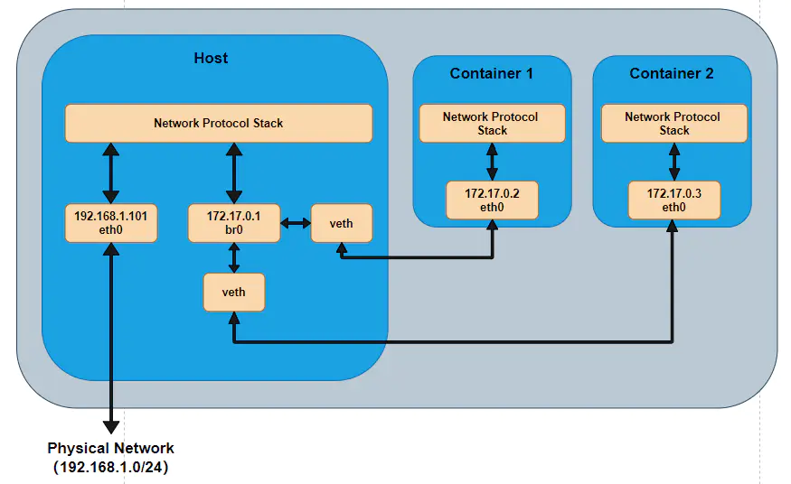

# Docker的网络原理

> 有一次在一台物理服务器上安装 docker ，安装好后创建容器，发现居然网络不通，无论怎样上网查资料都网络不通。后来上网搜索资源大致搞懂原理了，然后关闭了容器自动创建网络的方式，手动创建网络，最终网络通了。这篇文章首先理解 Docker 的网络原理，然后再做个手动创建网络连接的实验。


#### 通过 NAT 转发实现上网

当我们使用默认的方式创建容器，Docker 默认会创建一个网桥，并将容器连接到网桥上面。如下图所示，系统自动创建了一个 br0 的网桥，Container1 和 Container2 分别连接上该网桥上面。



由上面的图，可以看到 br0 网络是一个内部网络，在 Container1 、Container2 是访问不了外部的网络的。如果在容器内部访问外部网络就需要用到 NAT 转发了。

```shell
[root@test ~]# docker ps
0b2eaca85456    centos7:v1    "/usr/bin/supervisor…"    23 months ago    Up 9 months    0.0.0.0:3022->22/tcp    centos7-sshd
```

这是我某台服务器上运行的一个容器，容器内部是 22 端口，3022是外部端口。我们在外网通过该服务器的IP:3022 连接到这个容器操作系统上。这个 NAT 转发不需要我们做任何操作，Docker 已经帮我们在 iptables 上自动创建了一条 NAT 的转发规则。

```shell
-A FORWARD -i br-f5592f06e158 -o br-f5592f06e158 -j ACCEPT
```

到此，我们大致清楚容器是通过 NAT 转发实现上网的。回到文章最开始提到的那种情况，当 Docker 自动创建的网络不通时，我们怎样手动创建网络，实现连接呢？


#### 手动创建网络

首先我们创建一个没有网络的容器，如下面的例子配置 docker-compose

```shell
version: "2"
services:
    resin:
      container_name: resin
      image: resin:v1
      restart: always
      volumes:
        - /home/resin/ssh/ssh_host_rsa_key:/etc/ssh/ssh_host_rsa_key
        - /home/resin/ssh/ssh_host_rsa_key.pub:/etc/ssh/ssh_host_rsa_key.pub
        - /home/resin/ssh/sshd_config:/etc/ssh/sshd_config
        - /home/resin/domain-web:/root/www/domain-web
        - /home/resin/resin.sh:/opt/resin-4.0.60/bin/resin.sh
        - /home/resin/supervisor/supervisord.conf:/etc/supervisord.conf
        - /home/resin/supervisor/conf.d:/etc/supervisord.d
        - /home/resin/supervisor/logs:/etc/supervisord.d/logs
      network_mode: "none"
      entrypoint:
        - /usr/bin/supervisord
        - -n
        - -c
        - /etc/supervisord.conf
```

network_mode: "none"，表示容器不自动创建网络。接下来，我们手动创建网桥 docker-br3，并将容器连接到网桥上

```shell
brctl addbr docker-br3 # 创建网桥
ip addr add 172.25.0.1/24 dev docker-br3 # 设置网桥的路由
ip link set dev docker-br3 up # 启动网桥
pipework docker-br3 resin 172.25.0.23/16@172.25.0.1 # 设置容器的IP
```

这时，我们在宿主机上 ping 172.25.0.23 是可以 ping 通容器的IP的，证明容器内网环境已经配置好。最后我们要解决的是容器内部上网的问题。

```shell
firewall-cmd --permanent --add-rich-rule='rule family=ipv4 source address={可以访问的外部IP}/32 forward-port port=8080 protocol=tcp to-port=8080 to-addr=172.25.0.23'
```

通过 firewall 的端口转发功能，将外部的 8080 端口的流量转发到容器内部的 8080 端口，最终实现容器上网的功能。

#### 结果书本理解 NAT


