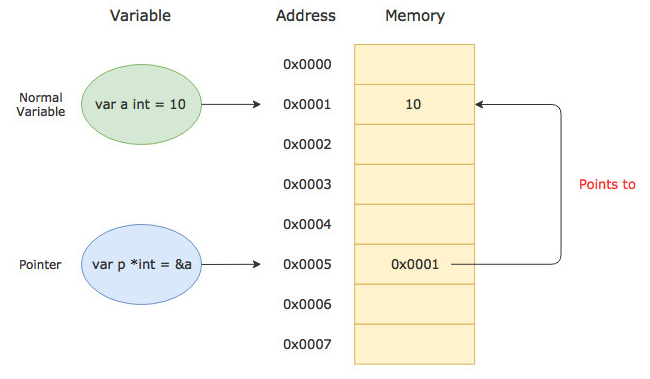

# 指针和地址

```go
var data *JSONStruct
if err := json.Unmarshal(jsonData, data); err != nil {
	t.Fatal("JSON序列化失败", err, no)
} 
```
上面代码，我想将指针传入`json.Unmarshal`函数，但执行报错：`json: Unmarshal(nil *main.JSONTestStruct)`。

```go
// 函数声明：
func Unmarshal(data []byte, v interface{}) error
// 函数说明：
Unmarshal parses the JSON-encoded data and stores the result in the value pointed to by v. If v is nil or not a pointer, Unmarshal returns an InvalidUnmarshalError
```

如果`v`为`nil`或不是指针，则`Unmarshal`返回`InvalidUnmarshalError`，所以传指针当参数也应该也是正确的。

为什么会出现这个错误呢？在回答这个问题之前，我们首先看看什么是指针：

> 变量是一种占位符，用于引用计算机的内存地址，可理解为内存地址的标签。指针是存储另一个变量的内存地址的变量。所以指针也是一种变量，只不过它是一种特殊变量，它的值存放的是另一个变量的内存地址。
>
>  

当使用`var data *JSONStruct`声明变量，分配了内存空间，但并没有赋值，默认是指向`nil`的。用一段简单的测试代码说明：

```go
func main() {
	var a = 1
	var b *int
	fmt.Printf("%p %p %p\n", &a, &b, b)
	b = &a
	fmt.Printf("%p %p %p\n", &a, &b, b)
}
// 输出结果：
// 0xc000132000 0xc00012c018 0x0
// 0xc000132000 0xc00012c018 0xc000132000
// https://go.dev/play/p/1zH1w05-eoi
```

当`var b *int`声明变量，就已经分配了内存地址`0xc00012c018`，由于没有赋值默认指向`nil`，所以第一次输出为`0x0`。当`b = &a`赋值后，内存地址还是`0xc00012c018`，值指向了`a`的内存地址。

我们接着回到前面那个错误。在调用` json.Unmarshal`函数时，它会尝试将`JSON `数据反序列化到`data `指向的内存空间中，但是由于`data `指向的内存地址为`nil`，因此会导致程序抛出异常。

解决方法是在调用` json.Unmarshal`函数之前先为`data `变量分配内存，可以使用如下的代码来实现：

```go
data := &JSONStruct{}
if err := json.Unmarshal(jsonData, data); err != nil {
	t.Fatal("JSON序列化失败", err, no)
}
```

在这段代码中，我们创建了一个空的`JSONStruct`结构体，然后它的内存地址赋值给了`data`变量。这样，在调用`json.Unmarshal`函数时，就不会再抛出异常了。


除了上面那样修改，也可以改为下面这种方式：

```go
var data JSONStruct
fmt.Printf("%p %v\n", &data, data) // 输出 0xc0000f6300 { 0  [] []  0 0}
if err := json.Unmarshal(jsonData, &data); err != nil {
	t.Fatal("JSON序列化失败", err, no)
}
```

在这段代码中，声明了一个普通的结构体变量，并没有赋值，所以是一个空的结构体，输出的值都是0和空切片。这时在调用`json.Unmarshal`函数时，获取`data`的地址。

### 总结：

1. 变量声明会分配内存地址，并设置默认值。
2. 指针也是变量，是保存内存地址的特殊变量，声明后默认值是`nil`。
3. 结构体声明后，会分配一个默认空的结构体。
