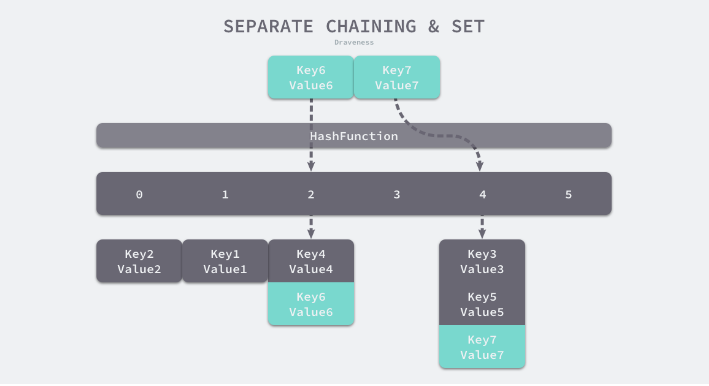
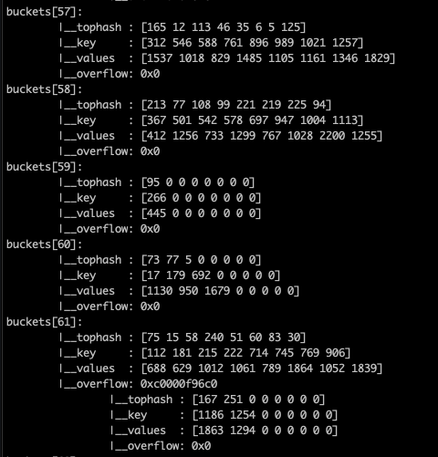
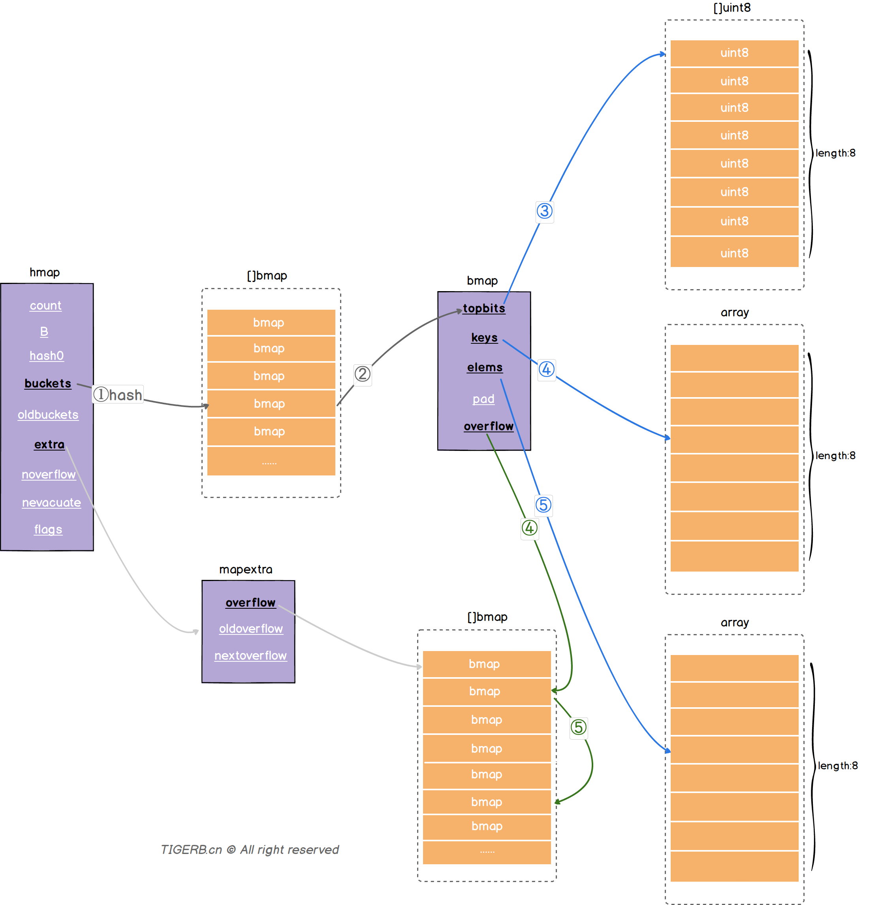
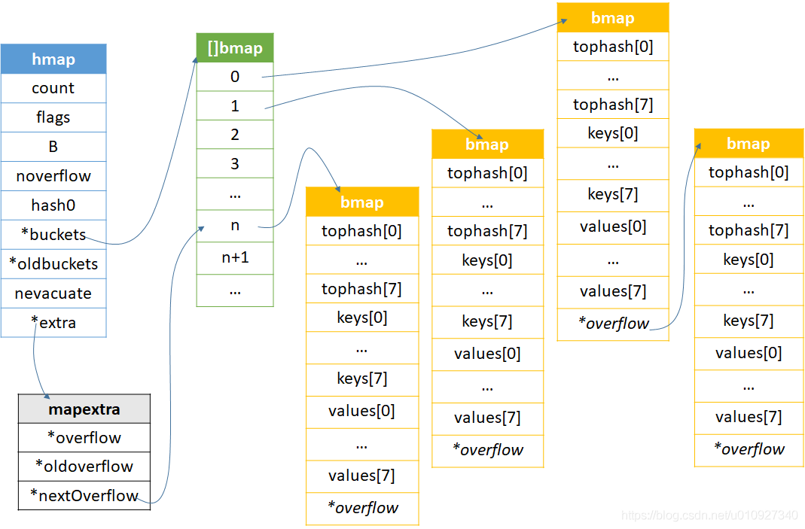

# 理解 map 底层原理

### 什么是哈希表

哈希表是一种数据结构，它用来存储一组键/值对，其中的键是唯一的。它使用一个函数，将键映射到一个数组的指定位置，这个位置称为桶。哈希表提供了一种快速查找键/值对的方法，时间复杂度为O(1)，这是因为我们可以直接跳转到键所在的桶来查找值。

这样看哈希表是否跟我们使用的英语字典比较像呢？当我们使用英语字典查一个单词时，不需要一页页从头翻到尾，只需要查到单词首字母，再按单词顺序在索引就可以快速定位到我们具体单词所在的页数。

几乎所有的编程语言都有哈希表的实现，在`PHP`中是关联数组，在`Python`中是字典等等。

### map 底层原理

`map`是用来存储键/值对的一种数据结构，采用哈希表作为底层实现，用拉链法解决hash冲突。下图是一个简单的原理示意图：

  

如上图所示，`key`经过`HashFunction`哈希函数定位到具体的桶（数组）上，当多个不同的`key`定位到同一个桶时，添加到桶的未尾。这样看原理很简单，但`map`底层的原理实际上要比上图复杂得多，除了通过哈希函数计算出来的值的低 5 位选中桶，还要通过哈希函数计算出来的值的高 8 位选择桶内的元素，还要解决桶溢出的问题和并发的问题等等。

下面用具体的图例来说明：

 

上图中，假定 B = 5，所以 bucket 总数就是 2^5 = 32。首先计算出待查找 key 的哈希，使用低 5 位 00110，找到对应的 6 号 bucket，使用高 8 位 10010111，对应十进制 151，在 6 号 bucket 中寻找 tophash 值（HOB hash）为 151 的 key，找到了 2 号槽位，这样整个查找过程就结束了。

如果在 bucket 中没找到，并且 overflow 不为空，还要继续去 overflow bucket 中寻找，直到找到或是所有的 key 槽位都找遍了，包括所有的 overflow bucket。

下图更直观的显示了`bucket`内存数据结构：

 

通过上面的两个具体图例，我们大概清楚了`map`的底层运作原理，接着我们深入源码，来看看`map`的内部结构。

在源码中，表示`map`的结构体是`hmap`，它是`hashmap`的“缩写”。

```go
type hmap struct {
    // 元素个数，调用 len(map) 时，直接返回此值
	count     int
	flags     uint8
	// buckets 的对数 log_2
	B         uint8
	// overflow 的 bucket 近似数
	noverflow uint16
	// 计算 key 的哈希的时候会传入哈希函数
	hash0     uint32
    // 指向 buckets 数组，大小为 2^B
    // 如果元素个数为0，就为 nil
	buckets    unsafe.Pointer
	// 等量扩容的时候，buckets 长度和 oldbuckets 相等
	// 双倍扩容的时候，buckets 长度会是 oldbuckets 的两倍
	oldbuckets unsafe.Pointer
	// 指示扩容进度，小于此地址的 buckets 迁移完成
	nevacuate  uintptr
	extra *mapextra // optional fields
}
```

buckets 是一个指针，最终它指向的是一个结构体：

```go
type bmap struct {
	tophash [bucketCnt]uint8
}
```

这只是表面的结构，编译期间会动态地创建一个新的结构体：

```go
type bmap struct {
    topbits  [8]uint8
    keys     [8]keytype
    values   [8]valuetype
    pad      uintptr
    overflow uintptr
}
```

下面用别个总结的两张图，显示map底层的内存模型：

 

 

到这里我们清楚了`map`的大概底层原理，但一些比较高级的概念如扩容、迁移、并发安全并没有涉及到，等以后接触到这些方面再深入研究。

---

### 用 map 底层原理来解释下面这个例子

```go
package main

import (
	"fmt"
	"reflect"
	"unsafe"
)

type Iptables map[string]string

func (i Iptables) Accept() {
	p := unsafe.Pointer(&i)
	i["b"] = "B"
	r := reflect.ValueOf(i).Pointer()
	fmt.Println("Accept:", i, r, p)
}

func main() {
	i := make(Iptables)
	i["a"] = "A"
	p := unsafe.Pointer(&i)
	r := reflect.ValueOf(i).Pointer()
	fmt.Println("main:", i, r, p)
	i.Accept()
	p = unsafe.Pointer(&i)
	fmt.Println("main:", i, p)
}
// 输出结果：
// main: map[a:A] 824633811376 0xc000012028
// Accept: map[a:A b:B] 824633811376 0xc000012038
// main: map[a:A b:B] 0xc000012028
// https://go.dev/play/p/QGVieNgMB9S
```

为什么`Accept`方法的接收器是值而不是指针，但在`Accept`方法内修改`i`的值`main`函数的`i`的值也会跟着变化呢？

`map`的低层结构体是`hmap`，当用`map`的实体传参时，相当于方法拷贝了`hmap`结构体的值，`buckets`和`oldbuckets`这2个字段并没有真正存取数据，只是存了一个指针，指向存取`buckets`的地址，故我们在使用过程中拷贝`hmap`的时候，并没有真正拷贝`map`的数据，只是拷贝了`hmap`这个结构体的一些数据。

所以我们用`map`做函数参数或者方法接收器时，不需要用`map`的指针，使用值就可以。

---

#### 参考：

[详解哈希数据结构，手写哈希表](https://juejin.cn/post/7007218290711855134)
[图解哈希表及其原理](https://www.cnblogs.com/Steven-HU/p/14505316.html)
[程序员常说的「哈希表」是个什么鬼？](https://www.woshipm.com/pmd/805326.html)
[Golang - Map 内部实现原理解析](https://www.cnblogs.com/yinbiao/p/15819230.html)
[Go 程序员面试笔试宝典：什么是 map](https://golang.design/go-questions/map/principal/#%e4%bb%80%e4%b9%88%e6%98%af-map)
[Go Map底层实现原理](https://zhuanlan.zhihu.com/p/495998623)
[彻底理解golang map](https://www.mdnice.com/writing/91a29ea30b104d90a5a306ad7c03bf59)
[Go map底层原理（哈希表）](https://blog.csdn.net/star_of_science/article/details/121802354)
[曹大的golang笔记](https://github.com/cch123/golang-notes/blob/master/map.md)
[我可能并不会使用golang map](https://juejin.cn/post/6844904163743105038)
[GO基础之MAP-写在前面（一）](https://www.cnblogs.com/zhangshen023/articles/14038471.html)
[Golang map 三板斧第三式：实现原理](https://cloud.tencent.com/developer/article/1746966)
