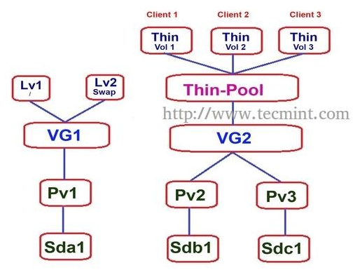

# 使用LVM实现KVM的快照功能

## 基本概念

 

**实体卷**　：物理卷，由真实的分区组成（`Physical Volume`，`PV`）
**逻辑卷组**：一个或多个物理卷组成逻辑卷组（`Volume Group`，`VG`）
**逻辑卷**　：逻辑卷用于创建文件系统（`Logical Volume`，`LV`）
**物理块**　：一个卷组中最小的连续区域（默认为4 MiB），多个物理块将被分配给一个逻辑卷（`Physical Extend`,`PE`） 
PE越大，`LVM`的碎片就越少，但它在移动东西和填充空洞方面的效率可能越低。所以`PE`的大小究竟设置为多少比较合适呢？

**LVM各组件的实现流程：**
 

上图摘自《鸟哥私房菜》的图例，上图说到需要将磁盘的`ID`改为`8e`，但据我的实际使用经验并不需要，系统会自动识别为`8e`。
如果我们仅需要LVM实现磁盘容量的弹性管理，使用还是挺简单的。

**常用命令**

| 任务                | PV 阶段   | VG 阶段   | LV 阶段             |
| ------------------- | --------- | --------- | ------------------- |
| 搜寻(scan)          | pvscan    | vgscan    | lvscan              |
| 创建(create)        | pvcreate  | vgcreate  | lvcreate            |
| 列出(display)       | pvdisplay | vgdisplay | lvdisplay           |
| 添加(extend)        |           | vgextend  | lvextend (lvresize) |
| 减少(reduce)        |           | vgreduce  | lvreduce (lvresize) |
| 删除(remove)        | pvremove  | vgremove  | lvremove            |
| 改变容量(resize)    |           |           | lvresize            |
| 改变属性(attribute) | pvchange  | vgchange  | lvchange            |


## LVM 快照

LVM除了可以实现磁盘容量的弹性管理，还有一个很重要的功能就是能够实现快照。我们先来看一篇快照的实际使用例子：《[烂泥：LVM学习之KVM利用LVM快照备份与恢复虚拟机](https://www.ilanni.com/?p=6519)》，这篇文章演示了怎样使用快照备份和恢复虚拟机。关键命令行如下：

```shell
# 新建一个逻辑卷：/dev/vg1/lvmsp
lvcreate -L 30G -n lvmsp vg1
# 格式化新建的逻辑卷
mkfs.ext4 /dev/vg1/lvmsp
# 在系统中新建一个目录用来挂载刚刚新建的逻辑卷
mkdir /test
mount /dev/vg1/lvmsp /test
# KVM虚拟机的硬盘存放到/test目录下
cp -v /vhostdisk/testlvmos.img /test/
# 编辑虚拟机的XML文件，将磁盘文件改为 /test/testlvmos.img
virsh edit testlvmos
virsh start testlvmos

# 关机，给逻辑卷/dev/vg1/lvmsp1 做一个快照
virsh shutdown testlvmos
lvcreate -L 100M -s -n lvmsp1 /dev/vg1/lvmsp
# 其中–s表示要创建快照，-n表示快照的名称，-L 表示快照的大小

# 将逻辑卷/dev/vg1/lvmsp的快照进行挂载
mkdir /test1/
mount /dev/vg1/lvmsp1 /test1/
# 备份文件后删除快照
cp -v /test1/testlvmos.img /baklvm/
umount /test1/
lvremove /dev/vg1/lvmsp1
```

#### 文章最后总结：
* `LVM`快照卷无需做格式化等步骤，可以直接对快照卷进行挂载，卸载等操作，而且操作完成之后，就应该立即删除快照，以减轻系统的`I/O`负担。 快照不会自动更新，长久保留是没有意义的。

这里有个疑问：“立即删除快照，以减轻系统的`I/O`负担。 快照不会自动更新” 既然快照不会自动更新，应该不会造成`I/O`负担的？想要解释这个问题，我们需要了解LVM快照的原理。

> **LVM 快照的原理（一）** - 摘自 http://cn.linux.vbird.org/linux_basic/0420quota.php#lvm_snapshot
> 什么是系统快照啊？快照就是将当时的系统资讯记录下来，就好像照相记录一般！ 未来若有任何数据更动了，则原始数据会被搬移到快照区，没有被更动的区域则由快照区与文件系统共享。 用讲的好像很难懂，我们用图解说明一下好了：
>
> 
> 图 3.5.1、LVM 系统快照区域的备份示意图(虚线为文件系统，长虚线为快照区)
>
> 左图为最初建置系统快照区的状况，LVM 会预留一个区域 (左图的左侧三个 PE 区块) 作为数据存放处。 此时快照区内并没有任何数据，而快照区与系统区共享所有的 PE 数据， 因此你会看到快照区的内容与文件系统是一模一样的。 等到系统运行一阵子后，假设 A 区域的数据被更动了 (上面右图所示)，则更动前系统会将该区域的数据移动到快照区， 所以在右图的快照区被占用了一块 PE 成为 A，而其他 B 到 I 的区块则还是与文件系统共享！
>

> **LVM 快照的原理（二）** - 摘自 https://blog.51cto.com/advice/1619386
> 快照(snapshot)是LVM所提供的一个非常有用的特性。它的原理是复制 Origin 原始卷的元数据(metadata)来创建一个逻辑卷，并没有复制物理卷上的任何数据， 因此它的创建过程是实时瞬间完成的。快照是特殊类型的逻辑卷，它含有创建时刻所指定的原始逻辑卷的完整数据，您可以操作快照而无需担心数据的变更令备份失效。
>
> LVM 快照利用一种称为“写时复制（COW - Copy-On-Write）”的技术来跟踪和维持其数据的一致性。它的原理比较简单，就是跟踪原始卷上块的改变， 在这些数据被改变之前将其复制到快照自己的预留空间里（顾名思义称为写时复制）。 当对快照进行读取的时候，被修改的数据从快照的预留空间中读取，未修改的数据则重定向到原始卷上去读取，因此在快照的文件系统与设备之间多了一层COW设备。
>
> 利用快照您可以冻结一个正在使用中的逻辑卷，然后制作一份冻结时刻的备份，由于这个备份是具有一致性的，因此非常的适合于用来备份实时系统。例如，您的运行中的数据库可能即使在备份时刻也是不允许暂停服务的，那么就可以考虑使用LVM的快照模式，然后再针对此快照来进行文件系统级别或者块设备级别的数据备份。

由上面的我们可道`LVM`快照是通过`COW`技术实现的，和`KVM`的快照不一样，`KVM`快照是通过`ROW`技术实现的（具体区别可看：[再谈 COW、ROW 快照技术](https://www.cnblogs.com/jmilkfan-fanguiju/p/7532227.html)，“**`COW`的快照卷存放的是原始数据，而`ROW`的快照卷存放的是新数据**”）。当我们系统不断变化时，快照也是不断更新的，而且是二次写入的，所以会加大系统的`I/O`负担。

经典`LVM`快照适用于临时的、短期的快照 - 基本上仅用于备份目的（并在备份完成后立即删除）。您不应该将它们用于长期快照 （否则您会看到性能低得多和启动延迟）。如果您想拥有长期快照，您应该使用`LVM Thin`快照。（翻译摘自：https://www.mail-archive.com/linux-lvm@redhat.com/msg02350.html）


### LVM  Thin - 精简卷

 

`LVM Thin`的最大特点在于可以对存储资源进行按需动态分配，即对存储进行了虚拟化管理。翻了很多文档都是说`LVM Thin`的好处和怎样使用`LVM Thin`的，几乎找不到文章说`LVM Thin`的原理的，只是从下面这篇文章找到部分不详细的解析。可能只有深入代码才能找到答案了，这样就不再深究了。

> 在标准的逻辑卷中磁盘空间在创建时就会占用卷组的空间，但是在瘦（`thin`）卷中只有在写入时才会占用存储池`thin pool LV`中的空间。
> 一个 thin逻辑卷创建前必须创建`thin pool LV`，一个`thin pool LV`由两部分组成：
> 一个大的`data LV`（数据卷）用来储存数据块，和一个`metadate LV`（元数据卷）。
> `metadata`中记录了`thin`卷中每个块数据的所属关系。
> （说简单点就是`metadata`中**储存索引**，`data`中储存真实数据，当你访问数据时，先通过索引再访问数据，因为你每次首先访问的不是真实数据，
> 所有就像C语言中**链表**一样，理论上储存的数据可以无限大，并且动态可调）。
>
> 摘自：https://blog.csdn.net/IndexMan/article/details/120267326

我们使用`LVM Thin`不单单是使用它的资源的按需动态分配，最重要的还是使用它的快照功能。`PVE`默认是使用`LVM Thin`来存储的，所以我安装了`PVE`来研究，看它是怎样实现快照的功能的。我登录管理后台，手动创建快照：

```shell
root@pve:~# lvs
  Logical Volume
  ==============
  LV                     VG  Attr       LSize   Pool Origin Data%  Meta%  Move Log Cpy%Sync Convert
  data                   pve twi-aotz-- 147.12g             10.64  1.38
  root                   pve -wi-ao----  57.75g
  snap_vm-101-disk-0_sn1 pve Vri---tz-k  40.00g data
  snap_vm-101-disk-0_sn2 pve Vri---tz-k  40.00g snap_vm-101-disk-0_sn1
  snap_vm-101-disk-0_sn3 pve Vri---tz-k  40.00g data
  swap                   pve -wi-ao----   8.00g
  vm-101-state-sn1       pve Vwi-a-tz--  <8.49g data        1.10
  vm-101-state-sn2       pve Vwi-a-tz--  <8.49g data        1.70
  vm-101-state-sn3       pve Vwi-a-tz--  <8.49g data        2.43
```

接着我对快照进行了一系列的测试，得出如下结论：

> * 快照可以长期保存
> * 可以递归快照，即可以对快照再进行快照
> * 删除父级快照不影响子级快照的正常使用

这跟我们使用的`KVM`快照有很大的不同，`KVM`快照是链式的，不可以递归创建。而且链式快照中的任何一节删除了，都会影响整个快照的使用。还有回滚上的不同，链式快照回滚到其中一个快照，会导致链式后面的快照不可用。`LVM Thin`快照无论创建还是回滚、删除都十分之灵活。

在性能和存储方面：链式快照链条越长，越影响运行效率；链式快照也比`LVM Thin`快照占用更多的空间。

`LVM Thin`快照相比链式快照具体这么多优点，我们怎样在`KVM`使用它呢？


## 使用LVM实现KVM的快照功能

由于我们的母机数据盘并不是使用LVM，所以我们要将数据盘取消挂载重新创建LVM裸设备。

```shell
# 取消挂载
[root@localhost ~]# umount /data/
# 格式化系统
[root@localhost ~]# mkfs.xfs /dev/vdb1
# 删除原分区，再重建分区
[root@localhost ~]# fdisk /dev/vdb
Welcome to fdisk (util-linux 2.23.2).

Changes will remain in memory only, until you decide to write them.
Be careful before using the write command.

Command (m for help): p

Disk /dev/vdb: 214.7 GB, 214748364800 bytes, 419430400 sectors
Units = sectors of 1 * 512 = 512 bytes
Sector size (logical/physical): 512 bytes / 512 bytes
I/O size (minimum/optimal): 512 bytes / 512 bytes
Disk label type: dos
Disk identifier: 0x0009f63f

   Device Boot      Start         End      Blocks   Id  System
/dev/vdb1            2048   419428095   209713024   83  Linux

# 删除旧分区
Command (m for help): d
Selected partition 1
Partition 1 is deleted

# 重新创建分区
Command (m for help): n
Partition type:
   p   primary (0 primary, 0 extended, 4 free)
   e   extended
Select (default p): p
Partition number (1-4, default 1): 1
First sector (2048-419430399, default 2048):
Using default value 2048
Last sector, +sectors or +size{K,M,G} (2048-419430399, default 419430399):
Using default value 419430399
Partition 1 of type Linux and of size 200 GiB is set

# 保存
Command (m for help): w
The partition table has been altered!

Calling ioctl() to re-read partition table.
Syncing disks.

# 创建实休卷
[root@localhost ~]# pvcreate /dev/sdb
# 创建逻辑卷组(4M应该是表示PE的大小)
[root@localhost ~]# vgcreate -s 4M data /dev/sdb1
# 创建精简池
[root@localhost ~]# lvcreate -L 5000G -T data/thin-pool
# 创建精简逻辑卷
[root@localhost ~]# lvcreate -T data/data-pool -n qyi-99118396001-5932-01.img
```

创建好`LVM`祼设备后，我们编辑`KVM`的`xml`使用LVM裸设备，需要注意的是`xml`的`disk`的`type`是为“`block`”的，`driver`的`type`为“`raw`”，例子如下：

```xml
    <disk type='block' device='disk'>
      <driver name='qemu' type='raw'/>
      <source dev='/dev/data/qyi-99118396001-5932-01.img'/>
      <target dev='vda' bus='virtio'/>
    </disk>
```

接着我们挂载`cdrow`一步步安装好系统。

```xml
    <disk type='file' device='cdrom'>
      <driver name='qemu' type='raw'/>
      <source file='/home/images/cn_windows_server_2008_r2_standard_enterprise_datacenter_and_web_with_sp1_vl_build_x64_dvd_617396.iso'/>
      <target dev='hda' bus='ide'/>
      <readonly/>
    </disk>
```

至此，我们终于使用上`LVM`裸设备，接下来我们对`LVM`裸设备创建快照。

```sh
[root@localhost ~]# lvcreate -s --thinpool data/disk-pool qyi-99118396001-5932-01.img --name qyi-99118396001-5932-01.sn1
  Logical volume "qyi-99118396001-5932-01.sn1" created.
[root@localhost ~]#
[root@localhost ~]#
[root@localhost ~]# lvs
  LV                          VG     Attr       LSize   Pool      Origin                  Data%  Meta%  Move Log Cpy%Sync Convert
  root                        centos -wi-ao---- 171.57g
  swap                        centos -wi-ao---- <58.46g
  data-pool                   data   twi-aotz-- 500.00g                                   99.99  59.63
  data-volume                 data   Vwi-aotz-- 500.00g data-pool                         99.99
  disk-pool                   data   twi-aotz--   4.88t                                   0.60   10.73
  qyi-99118396001-5932-01.img data   Vwi-a-tz--  40.00g disk-pool                         75.00
  qyi-99118396001-5932-01.sn1 data   Vwi---tz-k  40.00g disk-pool qyi-99118396001-5932-01.img
```

当我们系统运行一般时间，我们想恢复为快照的状态时，怎么做呢？

```shell
# 我们尝试直接将xml的磁盘文件路径修改为.sn1
[root@localhost ~]# virsh edit qyi-99118396001-5932
[root@localhost ~]# virsh dumpxml qyi-99118396001-5932 | grep -C 3 qyi-99118396001-5932-01.sn1
    <emulator>/usr/libexec/qemu-kvm</emulator>
    <disk type='block' device='disk'>
      <driver name='qemu' type='raw'/>
      <source dev='/dev/data/qyi-99118396001-5932-01.sn1'/>
      <target dev='vda' bus='virtio'/>
      <address type='pci' domain='0x0000' bus='0x00' slot='0x07' function='0x0'/>
    </disk>
# 直接启动，出现错误，提示找不到文件
[root@localhost ~]# virsh start qyi-99118396001-5932
error: Failed to start domain qyi-99118396001-5932
error: Cannot access storage file '/dev/data/qyi-99118396001-5932-01.sn1': No such file or directory
# 进入/dev/data/我们看到并没有“sn1”的裸设备
[root@localhost ~]# ll /dev/data/
total 0
lrwxrwxrwx 1 root root 8 Jul 22 11:34 data-volume -> ../dm-22
lrwxrwxrwx 1 root root 8 Sep 20 12:21 qyi-99118396001-5932-01.img -> ../dm-26
# 原因是快照尚未激活：NOT available
[root@localhost ~]# lvdisplay /dev/data/qyi-99118396001-5932-01.sn1
  --- Logical volume ---
  LV Path                /dev/data/qyi-99118396001-5932-01.sn1
  LV Name                qyi-99118396001-5932-01.sn1
  VG Name                data
  LV UUID                32Wo5A-j2fj-6nl1-Ykhy-CDej-DwDx-s5R3Cj
  LV Write Access        read/write
  LV Creation host, time gs20-16-253, 2022-09-20 12:21:37 +0800
  LV Pool name           disk-pool
  LV Thin origin name    qyi-99118396001-5932-01.img
  LV Status              NOT available
  # open                 1
  LV Size                40.00 GiB
  Mapped size            17.64%
  Current LE             10240
  Segments               1
  Allocation             inherit
  Read ahead sectors     auto
  - currently set to     256
  Block device           253:27
# 激活快照后，再启动机器成功
[root@localhost ~]# lvchange -ay -Ky data/qyi-99118396001-5932-01.sn1
[root@localhost ~]# virsh start qyi-99118396001-5932

```

激活`Thin`快照时直接使用`lvchange -ay data/qyi-99118396001-5932-01.sn1`是激活不了快照的，因为“[By default, thin snapshot are set as not available and with the "skip activation" bit set](https://serverfault.com/questions/738587/lvm-thin-snapshot-unavailable)”，`Thin`快照默认设置了跳过激活(`activation skip`)的标识，我们需要忽略跳过激活(`activation skip`)的标识或者将清除跳过激活（`activation skip`）标识：`lvchange -kn data/qyi-99118396001-5932-01.sn1`。

>     **LVCHANGE(8)**
>     NAME
>         lvchange - Change the attributes of logical volume(s)
>     -K|--ignoreactivationskip
>         Ignore the "activation skip" LV flag during activation to allow LVs with the flag set to be activated.
>     -k|--setactivationskip y|n
>         Persistently sets (yes) or clears (no) the "activation skip" flag on an LV.  An LV with this flag set is not activated unless the --ignoreactivationskip option is used by the activation command.  This flag is set by default on new thin snapshot LVs.  The flag is not applied to deactivation.  The current value of the flag is indicated in the lvs lv_attr bits.


----

### PVE创建快照的输出

```shell
# pve 中是先创建 vm-xxx-state-xxx 再创建 snap_vm-xxx-disk-0_xxx ,vm-xxx-state-xxx就是内存快照，snap_vm-xxx-disk-0_xxx 才是磁盘快照。

....
  WARNING: You have not turned on protection against thin pools running out of space.
  WARNING: Set activation/thin_pool_autoextend_threshold below 100 to trigger automatic extension of thin pools before they get full.
  Logical volume "vm-101-state-sn5" created.
  WARNING: Sum of all thin volume sizes (282.44 GiB) exceeds the size of thin pool pve/data and the size of whole volume group (231.87 GiB).
saving VM state and RAM using storage 'local-lvm'
1.51 MiB in 0s
185.88 MiB in 1s
completed saving the VM state in 1s, saved 554.55 MiB
snapshotting 'drive-virtio0' (local-lvm:vm-101-disk-0)
  WARNING: You have not turned on protection against thin pools running out of space.
  WARNING: Set activation/thin_pool_autoextend_threshold below 100 to trigger automatic extension of thin pools before they get full.
  Logical volume "snap_vm-101-disk-0_sn5" created.
  WARNING: Sum of all thin volume sizes (322.44 GiB) exceeds the size of thin pool pve/data and the size of whole volume group (231.87 GiB).
TASK OK
```

-------

### 参考文章：

《[烂泥：LVM学习之KVM利用LVM快照备份与恢复虚拟机](https://www.ilanni.com/?p=6519)》

《[烂泥：KVM使用裸设备LVM配置虚拟机](https://www.ilanni.com/?p=6593)》

《[What is the guideline for the size of an LVM snapshot volume on RHEL?](https://access.redhat.com/solutions/36607)》

《[archlinux LVM](https://wiki.archlinux.org/title/LVM_(%E7%AE%80%E4%BD%93%E4%B8%AD%E6%96%87)#LVM%E5%9F%BA%E6%9C%AC%E7%BB%84%E6%88%90)》- 这篇教程写得通俗易懂，但没有写到快照功能

《[在LVM中设置精简资源调配卷（第四部分）](https://linux.cn/article-4288-1.html)》

《[Chapter 9. 创建和管理精简配置的逻辑卷（精简卷）](https://xy2401.com/local-docs/redhat/8.zh-Hans/configuring-and-managing-logical-volumes/OEBPS/assembly_thinly-provisioned-logical-volumes_configuring-and-managing-logical-volumes.html)》- 应该是红帽的文档，但这里的翻译感觉比较顺

《[How to Take ‘Snapshot of Logical Volume and Restore’ in LVM – Part III](https://www.tecmint.com/take-snapshot-of-logical-volume-and-restore-in-lvm/)》

《[PVE重启后LVM Thin数据丢失，错误：Volume group "****" has insufficient free space (128 extents): 4048 required](https://www.quarkbook.com/?p=1187).》- 当出错怎样处理

《[LVM backup and restore snapshot in Linux](https://linuxconfig.org/create-and-restore-manual-logical-volume-snapshots)》- 使用厚LVM快照比较易明的教程

《[KVM:ConvertQcow2ToLVM](https://www.headdesk.me/KVM:ConvertQcow2ToLVM)》- 通过这种方式可以将 Qcow2 转称为 LVM

《鸟哥私房菜：[**第十五章、磁碟配额(Quota)与进阶文件系统管理**](http://cn.linux.vbird.org/linux_basic/0420quota.php)》- 比较基础和全面的教程
