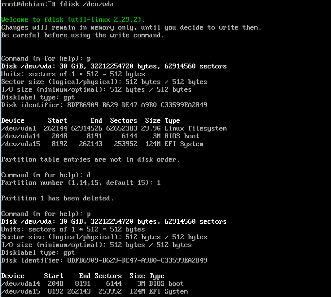
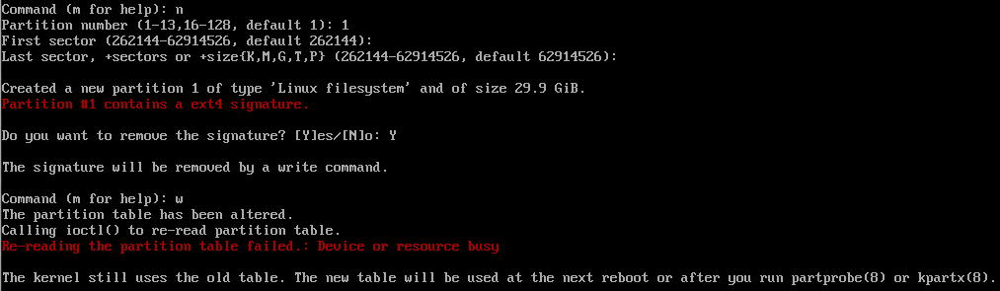

# 怎样利用cloud镜像制作自己的ubuntu/debian镜像

`ubuntu`和`debian `有官方制作好的`cloud`镜像，我们可以利用`cloud`镜像，进行二次封装，制作成我们自己的需要的镜像。

下载 cloud 镜像

```shell
wget https://cloud-images.ubuntu.com/releases/focal/release-20211129/ubuntu-20.04-server-cloudimg-amd64.img --no-check-certificate
wget https://cloud.debian.org/images/cloud/bullseye/latest/debian-11-nocloud-amd64.qcow2 --no-check-certificate
```

下载到的镜像需配置 [cloud-init](https://cloud-init.io/) 进行初始化和配置，我们没用到 cloud-ini 直接跳过。

```shell
[root@localhost Images]# qemu-img info debian-11-nocloud-amd64.qcow2
image: debian-11-nocloud-amd64.qcow2
file format: qcow2
virtual size: 2.0G (2147483648 bytes)
disk size: 293M
cluster_size: 65536
Format specific information:
    compat: 1.1
    lazy refcounts: false
    refcount bits: 16
    corrupt: false
```

从上面可以看到，下载到的镜像，虚拟空间大小只有`2G`，需要进行扩容操作。

```shell
# 扩容
qemu-img resize ubuntu-20.04-server-cloudimg-amd64.img 30G
qemu-img resize debian-11-nocloud-amd64.qcow2 30G
```

使用上面扩容后的镜像创建一台虚拟机，进入虚拟机进行根分区扩容（[参考链接](https://zhuanlan.zhihu.com/p/83340525)）。

 

 

重启后，使用`resize2fs /dev/vda1`刷新根分区，再执行`df -hT`可以看到根目录已成功扩容。

接下来对系统进行一些设置

```shell
# 系统升级
apt-get update
# 为确保时间同步正确，再安排另一种时间同步
apt-get -y install rdate
whereis rdate
# crontab -e 增加如下定时任务
*/20 * * * * {由上面得出 rdate 的执行路径} -s time.nist.gov > /dev/null 2>&1

# 生成 ssh 文件
# ssh-keygen -A

# 设置可以 ssh 密码登录，也可以使用 vi 进入 /etc/ssh/sshd_config 文件编辑
sed -i 's/#PermitRootLogin prohibit-password/PermitRootLogin yes/' /etc/ssh/sshd_config
sed -i 's/PasswordAuthentication no/PasswordAuthentication yes/' /etc/ssh/sshd_config

# 当 vi 编辑文本无法正常使用时，执行下面两行
sed -i '$a\set nocompatible' /etc/vim/vimrc.tiny
sed -i '$a\set backspace=2' /etc/vim/vimrc.tiny

# 清除 /etc/fstab 挂载 /home 目录
vi /etc/fstab
```

上面，我把`ssh-keygen -A`注释了，因为直接在镜像生成`key`文件，当使用这个镜像生成新的虚拟机 key 文件是一样的，这样不安全。我们通过`crontab`来生成，首先创建一个`/etc/ssh/generateSshHostKey.sh`脚本，`chmod +x /etc/ssh/generateSshHostKey.sh` 赋于可执行的权限。

```shell
#!/bin/bash

if [ ! -f "/etc/ssh/ssh_host_rsa_key" ] || [ ! -f "/etc/ssh/ssh_host_ecdsa_key" ] || [ ! -f "/etc/ssh/ssh_host_ed25519_key" ]
then
        /usr/bin/ssh-keygen -A
        systemctl restart sshd
fi
```

再在`crontab -e`添加以下行：

```
@reboot /etc/ssh/generateSshHostKey.sh > /dev/null 2>&1
```

安装qemu-guest-agent，执行命令`apt-get install qemu-guest-agent -y`进行安装。安装完，关机，再在宿主机启动，然后在宿主机执行下面的命令，如果返回`{"return":{}}`证明安装成功。

```shell
virsh qemu-agent-command qyi-00000000000-8005 '{"execute":"guest-ping"}'
{"return":{}}
```

在宿主机执行如行命令，将基础镜像提交到增量镜像

```shell
virsh blockpull qyi-00000000000-8005 --path {系统盘路径} --wait --verbose
virsh shutdown qyi-00000000000-8005
cp {系统盘路径} ubuntu20.04_x64_2020_v2.qcow2
```

设置完，关机使用命令清空刚刚登录的操作的历史记录之类的。

```shell
# 使用 virt-sysprep 清理镜像（该命令可清理MAC和操作历史等一系列操作）
virt-sysprep -a ubuntu18.04.4_x64_2022_v1.qcow2

# 由于我们前面做了 crontab ，使用 virt-sysprep 会清空我们的定时任务，所以我们不要用上面那条命令，用下面这条
virt-sysprep --list-operations
virt-sysprep --timezone "Asia/Shanghai" --enable abrt-data,backup-files,bash-history,blkid-tab,crash-data,dhcp-client-state,dhcp-server-state,dovecot-data,logfiles,machine-id,mail-spool,net-hostname,net-hwaddr,pacct-log,package-manager-cache,pam-data,passwd-backups,puppet-data-log,rh-subscription-manager,rhn-systemid,rpm-db,samba-db-log,script,smolt-uuid,ssh-hostkeys,ssh-userdir,sssd-db-log,tmp-files,udev-persistent-net,utmp,yum-uuid,customize,lvm-uuids -a ubuntu20.04_x64_2022_v1.qcow2

# 如果执行 virt-sysprep 出现如下错误
# virt-sysprep: error: libguestfs error: inspect_os: findfs exited with
# status 1: findfs: unable to resolve
# 'UUID=b92fc464-67ec-11ed-a03d-90b11c032b06'
# 是 /etc/fstab 未清除数据盘的挂载
```

最后压缩镜像

```shell
# 最后压缩镜像，减少文件大小，方便传输
qemu-img convert -c -O qcow2 ubuntu20.04_x64_2020_v1.qcow2 ubuntu20.04_x64_2020_v2.qcow2
```

