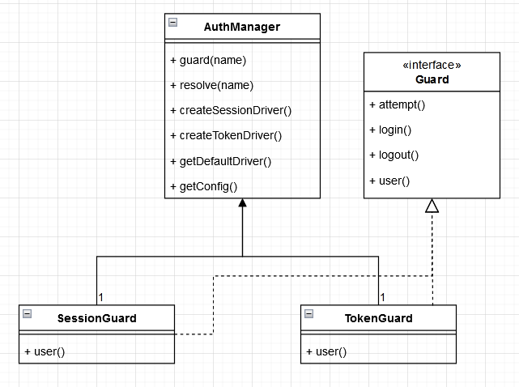

# Laravel设计模式之工厂方法模式

### 什么是工厂方法模式

**工厂方法模式**是一种创建型（创建对象时使用）设计模式， 其在父类中提供一个创建对象的方法， 允许子类决定实例化对象的类型。

工厂方法模式一般搭配配置文件使用，实现了模块化和可配置的设计，使系统具有更好的灵活性和可扩展性。


### Laravel框架里面的工厂模式

Laravel 其实很多地方有用到工厂方法模式，其中 Auth 认证就用到工厂方法模式。我们看一张简化了的类图：



AuthManager 是工厂方法，通过这个工厂方法来调用 createSessionDriver() 或 createTokenDriver() ，创建 SessionGuard 或 TokenGuard 的实例。当我们定义好 guard ，使用时只需要在控制器的构造函数加入

```php
$this->middleware('auth:admin');
```

即可实现认证的功能。通过《[auth 中间件是如何起作用的源码阅读笔记](https://learnku.com/articles/20813)》这篇文章，我们知道中间件真正起作用的是 

```php
$this->auth->guard($guard)->check()
```

这一条语句。

当我们需要增加新的认证，但原来的认证类不适用时，我们可以继承 Guard 接口，写过一个新的认证类，而不需要修改任何的业务逻辑代码。假如我们原系统是使用 SessionGuard 认证的，当我们想改为 TokenGuard 认证方式时，也很简单，我们只需要在 config 的配置文件修改切换即可。

通过工厂方法模式，使我们系统变得可模块化和可配置化。

除了 Auth ，还有 Illuminate\Cache 通过 [CacheManager](https://github.com/laravel/framework/blob/5.6/src/Illuminate/Cache/CacheManager.php) 实现多个缓存驱动，Illuminate\Filesystem通过 [FilesystemManager](https://github.com/laravel/framework/blob/5.6/src/Illuminate/Filesystem/FilesystemManager.php) 实现多个文件驱动，这两个均是工厂模式的典型实现。


### 如何优雅的实践 (段摘自：http://blog.neychang.com/posts/14)

Laravel框架的源码里面包含了很多可以学习和借鉴的设计模式实现范例，甚至上面所写的工厂模式，Laravel框架源码里面已经提供了一个通用的工厂实现抽象类 [Manager](https://github.com/laravel/framework/blob/5.6/src/Illuminate/Support/Manager.php) 来方便开发者利用它实现工厂模式。仔细看它的内部结构， 其实和上面的几个Manager类的思路是一致的。我们在业务开发中，如果需要实现工厂模式时，完全可以继承Manager抽象类，来管理自己的类实例化。

例如下面的写法:

```php
use Illuminate\Support\Manager;
use Illuminate\Support\Facades\Facade;
use Illuminate\Support\ServiceProvider;

// 工厂管理类
class DemoManager extends Manager{
	public function getDefaultDriver(){
		return 'default';
	}

	public function createDefaultDriver(){
		return new DefaultDemo;
	}

	public function createDemo1Driver(){
		return new OneDemo;
	}
}

// DefaultDemo
class DefaultDemo{
	public function foo(){
		return 'bar';
	}
}

// DefaultDemo
class OneDemo{
	public function foo(){
		return 'bar1';
	}
}

// 工厂门面
class DemoFacade extends Facade{
	/**
	* Get the registered name of the component.
	*
	* @return string
	*/
	protected static function getFacadeAccessor(){
		return 'demo';
	}
}

// 在ServiceProvider实例工厂管理类单例
class DemoServiceProvider extends ServiceProvider{
	public function boot(){
		$this->app->singleton('demo', function ($app) {
			return new DemoManager($app);
		});

		// 类名转名
		if (! class_exists('Demo')) {
			class_alias(DemoFacade::class, 'Demo')
		}
	}
}
```

这样我们便可方便的使用如下的代码：

```php
// 使用示例
Demo::driver()->foo(); // 输出 'bar'
Demo::driver("demo1")->foo(); // 输出 'bar1'
```

