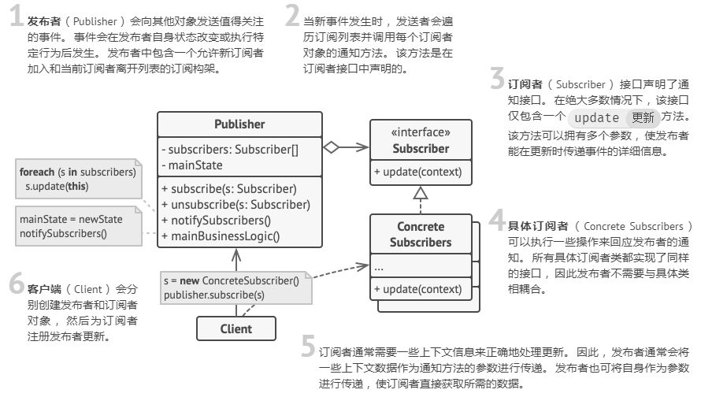

# Laravel设计模式之观察者模式

**观察者模式**是一种行为设计模式， 允许你定义一种订阅机制， 可在对象事件发生时通知多个 “观察” 该对象的其他对象。

**设计的总体原则**：对变化封装。目标：将变更造成的影响最小化，保护不变化的代码不受影响。

**对于观察者模式的个人理解**：基于上面这个原则，我们开发时，可以写好主代码（基本上是稳定的不会经常变化的代码），为以后可能增加的功能留有钩子。也就是保护主代码，避免当需要增加功能时，修改主代码造成原本正常运行的程序出错。

### 观察者模式结构

 


### Laravel 事件系统

`Laravel`的事件提供了一个简单的观察者实现，能够订阅和监听应用中发生的各种事件。事件类保存在`app/Events`目录中，而这些事件的的监听器则被保存在 `app/Listeners`目录下。下面是具体使用代码示例：

```php
// 将 Event 和 Listener 绑定并注册
class EventServiceProvider extends ServiceProvider
{
    protected $listen = [
        'App\Events\WhiteList\AddWhiteListBeforeEvent' => [
            'App\Listeners\WhiteList\AddWhiteListCheckEventListener',
        ],
        //...
    ];
```

```php
// 定义事件
class AddWhiteListBeforeEvent
{
    use Dispatchable, InteractsWithSockets, SerializesModels;

    public $requestData;
    public function __construct($requestData)
    {
        $this->requestData = $requestData;
    }

    //....
}
```

```php
// 定义监听
class AddWhiteListCheckEventListener
{
    public function __construct()
    {

    }

    public function handle(AddWhiteListBeforeEvent $event)
    {
        // 逻辑代码写这里
```

```php
// 主代码
event(new $AddWhiteListBeforeEvent($oriRequestArr)); // 添加事件钩子
```

`Lavavel`使用`EventServiceProvider`来定义事件和监听，所有事件和监听定义在同一个地方，一目了然，而且可以看到事件和监听的对应关系。而且`Lavael`事件还有一个好处是可以添加进队列，异步执行。


### 思考：怎样用观察者模式优化现有代码？

* **例子1**：当客户推广链接成功注册，会推送微信通知到相关业务员。这部分代码是直接嵌到注册的代码后面，如果这部分代码语法出错，有可能导致注册失败。可以将这部分代码改为事件执行，即使代码有问题，也不会影响到原有代码的正常执行。
* 继续补充中....

---

#### 参考：

[观察者模式](https://refactoringguru.cn/design-patterns/observer)

[Laravel 中的 Event 和事件的概念](https://learnku.com/articles/20712)
