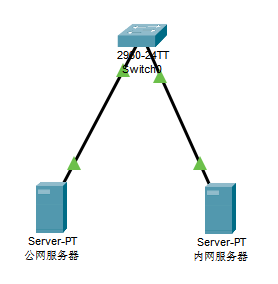

# 通过firewalld实现流量转发功能



如上图所示，有台交换机接了两台`centos7`服务器，一台是有公网IP的公网服务器，一台是无公网IP的内网服务器。这两台服务器连接着同一台交换机，也就是它们可以通过内网互访。

由于内网服务器没有公网IP，我们要远程管理内网服务器的话，只能先远程连接上公网服务器，再在公网服务器远程登录内网服务器。这种连接方式要通过公网服务器进行中转，略显麻烦，有没有其它更简便的方式呢？

考虑到使用的`centos7`的服务器，决定使用它的`firewalld`的流量转发功能，将内网服务器的`SSH`端口映射到公网服务器上。

```shell
firewall-cmd --permanent --add-rich-rule='rule family=ipv4 source address={可以访问的外部IP} forward-port port=20022 protocol=tcp to-port=22 to-addr=192.168.140.3'
firewall-cmd --reload
```

上面命令开通了端口映射，我们还需要开通流量转发

```shell
firewall-cmd --zone=public --permanent --add-masquerade
firewall-cmd --reload
```

最后我们来测试一下，流量是否正确转发到内网服务器。在本地电脑，执行`ssh root@{公网服务器IP}:20022`，可以正常登录。
