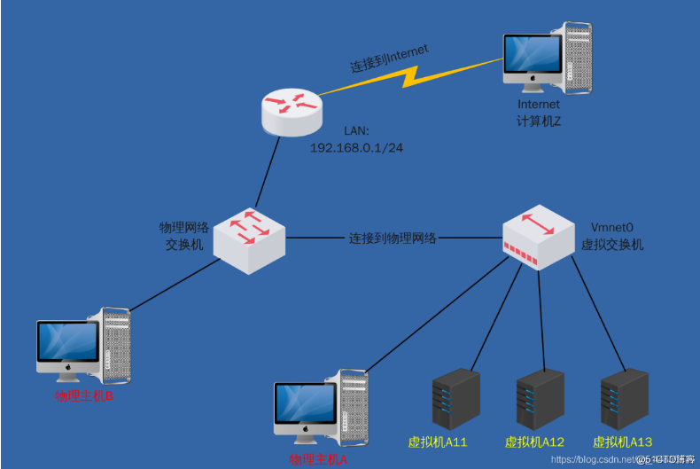

# VMware桥接虚拟机上不了网的问题排查

##### VMware 桥接的原理

VMnet0 实际上是虚拟的网桥。如上图所示，相当于在物理主机A 和 虚拟机 A11、A12、A13 前面增加了一个虚拟交换机。所以物理主机A 和 虚拟机 A11、A12、A13是属于同一个局域网的，互相可以互相 ping 通的。并且虚拟机 A11、A12、A13 设置和物理主机A一样的网关的话，理应也可以正常上网的。

##### 实际问题

在的工作电脑内网IP是 192.168.7.242，我在工作电脑安装了 VMware ，新开了一台虚拟机内网IP设为 192.168.7.161，网关设置为跟宿主机一样的 192.168.7.1。然后在宿主机和虚拟机分别互 ping 对方的IP，发现是可以互通的。但在虚拟机上发现 ping 不通外网IP，我再 ping 网关，发现也是正常。内网正常，网关也可以 ping 通，那就有可能是网关那个的路由器有什么问题了。问管理网络的同事，他路由说要绑定IP的，发 192.168.7.161 给他绑定，再测试终于正常了。

##### 总结

只有清楚了虚拟网的原理和网络拓扑图，当虚拟网络出现问题时，才能定位到问题出在哪里。
