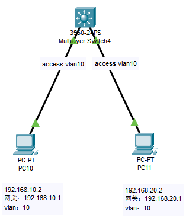

# 网络基础：什么是Vlan

我之前对`vlan`的概念理解一直是错的，认为是划分子网的，将一个大的网络通过`vlan`划分为几个小的子网，实现安全隔离。

### Vlan 的概念

> `VLAN`（`Virtual Local Area Network`）是一种逻辑上的网络隔离技术，它可以在物理网络上划分多个广播域。每个`VLAN`都有一个独立的IP地址空间，并且只能通过`VLAN`间路由进行通信。

上面是专业术语解释的概念，可能较为难理解，换成通俗的说法是：`vlan`是交换机上的虚拟接口，所有接到同一虚拟接口的机器可以互相通信。若要实现不同`vlan`的跨段`IP`通信，需要给`vlan-if`配置`IP`地址，并开启交换机的路由功能。


### `vlan`是二层技术还是三层技术

我用`Cisco Packet Tracer`来创建网络拓扑，发现`2960`交换机可以创建`vlan`，也可以给创建配置`IP`，但启动不了`ip routing`，所以`2960`是二层交换机。换成了`3650`交换机，就可以启动`ip routing`了，而且`Cisco Packet Tracer`在`3650`名称下面也显示`Multilayer Switch`，所以`3650`是三层交换机。

到这里我又有疑问了，不是说`IP`协议是三层技术吗？怎样我可以给`2960`的`vlan`配置`IP`呢？为了解答我心中的疑问，我用`Cisco Packet Tracer`做了两个小实验。

**第一个实验：**

 

pc4和pc6同属vlan10，我们在pc4上可以直接ping通pc6。由于2960交换机是二层交换机，说明vlan是在二层使用的技术。

**第二个实险：**

 

这个例子和上例差不多，不同的是我分别在`vlan10`、`vlan20`配置了`IP`，IP地址分别为`192.168.10.1`和`192.168.20.1`，并在`pc`上面配置了网关。但我在`pc7`上`ping pc8`，发现是不通的。这说明了不同`vlan`能够互通起作用的是三层路由，二层交换机没有路由功能，自然不通。

`2960`交换机本身并没有路由功能，但却可以设置`vlan-if`的`IP`。在二层交换机上配置`VLAN Interface`的`IP`地址并不能实现三层路由， 那却可以配置`vlan-if`的`IP`意义所在？

> 在`VLAN`中配置`IP`主要有以下几个作用：
> **管理   ：**在`VLAN`中配置`IP`地址，可以通过远程管理软件对`VLAN`中的主机进行管理。
> **安全   ：**在`VLAN`中配置`IP`地址，可以通过防火墙等安全设备来限制`VLAN`中的主机之间的通信，从而提高网络安全性。
> **DHCP：**`DHCP`服务器可以根据`VLAN`的`IP`地址来分配`IP`地址给`VLAN`中的主机，这样就可以避免`IP`地址冲突。
> **监控   ：**通过`VLAN`中的` IP`地址，可以使用网络监控工具来监控和管理`VLAN`中的主机。
>
> 总的来说，在`VLAN`中配置`IP`地址主要是为了更好的管理和控制`VLAN`中的主机。在没有其它特殊要求的情况下,不配置`IP`对网络的正常通信并没有影响。

最后，vlan是属于二层技术。


### 同`Vlan`配置不同网段

一般来说我们都尽量将不同的段，接入到不同的vlan，再通过三层路由功能，将交换机内的不同段之间的互通。工作中，有个需求是在同一个`vlan`中，如果我接入两个不同的`vlan`段，怎样实现这两个网段的互通？

 

上图，我创建了一个`vlan 10`，将`192.168.10.2`和`192.168.20.2`接入到`vlan 10`中，并设置`vlan 10`的主从`IP`，这样就可以在同一个`vlan`中配置不同的网段并实现互通。

```shell
Switch> enable                                                       // 进入特权模式
Switch# configure terminal                                           // 进入全局配置模式
Switch(config)# vlan 10                                              // 创建 vlan 10
Switch(config)# interface vlan 10                                    // 进入 vlan 10
Switch(config-if)# ip address 192.168.10.1 255.255.255.0             // 配置 vlan 10 的主ip地址
Switch(config-if)# ip address 192.168.20.1 255.255.255.0 secondary   // 配置 vlan 10 的从ip地址
Switch(config-if)# no shutdown                                       // 开启虚拟端口
```

注意`Cisco Packet Tracer`不支持配置`vlan`的从`IP`，上面配置`vlan`从`ip`的命令会出错，但在真实的交换机是可以配置从`IP`的。


### 总结

从这一节，更加证明了我之前对于的`vlan`的理解是错的，同一`vlan`的`IP`不只是相同网段的，还可以不同网段的。**`vlan`可以理解为交换机的虚拟端口**，同属于相同虚拟端口的网络可以互通，不同虚拟端口的网络通过路由功能实现互通（`ip routing`）。其实`vlan`与`linux`中的`bridge`很相似，同样的可以像`bridge`一样设置`IP`远程管理，也可以像`bridge`一样配置主从`IP`。

还有，`vlan`和`ovs`的`Internal`端口也有点相似，同样的`ovs`的`Internal`端口可以设置`IP`远程管理，也可以配置多个`IP`。

---

### 参考：

[VLAN是二层技术还是三层技术](https://www.zhihu.com/question/52278720)
[思科三层交换机配置](https://blog.51cto.com/u_13725021/2113295)


