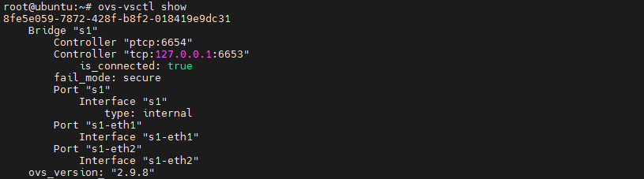
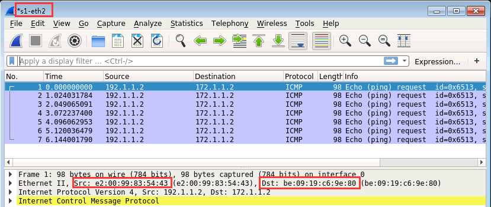

# [网络实险] 实现局域网不同网段的IP互通

> 一直以来我学到的网络知识都告诉我，当在一个局域网内，不同段的IP是没办法 ping 通的。我所在的公司的办公室有两个网段：192.168.7.0 和 192.168.8.0 ，如果我在本机搭建了一个测试网站，想给另一个网段的同事浏览，他们是没办法打开网站的。我突发奇想，可不可能通过设置机器或者路由，实现不同段的两台机器实现互通？以下是模拟的实验

### 实验步骤

1. ##### 在 ubuntu 系统机器上安装 mininet 

   为什么是使用 ubuntu 系统的机器，而不是我熟悉的 centos 系统的机器呢。因为我们测试的过程中需要使用到 mininet ，这个软件在 ubuntu 环境下安装比较简单。

   ```shell
   # 安装 mininet
   rm /var/lib/dpkg/lock-frontend
   rm /var/lib/dpkg/lock
   rm /var/cache/apt/archives/lock
   apt install git -y
   git clone git://github.com/mininet/mininet
   cd ./mininet/util/
   ./install.sh -a
   ```

   

2. ##### mininet 创建简单拓扑进行测试

   mininet 是 SDN 学习中用来创建各种拓扑的仿真软件，能够使用最小的消耗完成主机，交换机，控制器的模拟。使用 <font color=green>mn</font> 命令创建两个主机连接到一个交换机中的拓扑。

   

   当我们执行上面的命令后，自动创建了一个 s1 的 ovs 网桥，并且创建了两个节点：h1、h2，这两个节点连接到 s1 上。

   

   接着我们给 h1 和 h2 分别配置两个不同段的IP，并进行 ping 的测试，可以很明显看出两个节点是不能互通的。

   ```shsh
   h1 ifconfig h1-eth0 192.1.1.2 netmask 255.255.255.0
   h2 ifconfig h2-eth0 172.1.1.2 netmask 255.255.255.0
   h1 ping 172.1.1.2
   # Network is unreachable
   h1 route -n
   # Kernel IP routing table
   # Destination     Gateway         Genmask         Flags Metric Ref    Use Iface
   # 192.1.1.0       0.0.0.0         255.255.255.0   U     0      0        0 h1-eth0
   ```

   为什么不能互通呢？因为不同段的IP访问时，是用到IP协议，需要使用到网关。但很明显我们上面两个节点并没有设置到网关。

   <font color=orange>如果这时我创建一条指向 172.1.1.0 的路由，是否就可以实现将数据转发出去了？</font>

   ```shell
   # onlink 参数表明强制此网关是“在链路上”的(虽然并没有链路层路由),如果不加这个参数下面这条路由由于协议限制不同段的网关是添加不了的
   h1 ip route add 172.1.1.0/255.255.255.0 via 172.1.1.2 dev h1-eth0 onlink
   h1 route -n
   # Kernel IP routing table
   # Destination     Gateway         Genmask         Flags Metric Ref    Use Iface
   # 172.1.1.0       172.1.1.2       255.255.255.0   UG    0      0        0 h1-eth0
   # 192.1.1.0       0.0.0.0         255.255.255.0   U     0      0        0 h1-eth0
   ```

   从上面的命令可知，我们手动创建了一条 172.1.1.0 段的路由，并将网关设置为 172.1.1.2。设置为 172.1.1.2 ，是为了让以太网协议找到它的 MAC 的。这样所有 172.1.1.0 段的包都转发到 172.1.1.2。

   

3. ##### 使用 wireshark 抓包数据

   

   

   添加路由后，我们在 h1 上 ping h2，再打开 wireshark 抓包数据，从上图可以发现可以接收到 ping 请求的包了。但我们发现没有返回，原来我们只是弄通了单向，要双向弄通才会有返回的。继续设置：

   ```shell
   h2 ip route add 192.1.1.0/255.255.255.0 via 192.1.1.2 dev h2-eth0 onlink
   h2 route -n
   # Kernel IP routing table
   # Destination     Gateway         Genmask         Flags Metric Ref    Use Iface
   # 172.1.1.0       0.0.0.0         255.255.255.0   U     0      0        0 h2-eth0
   # 192.1.1.0       192.1.1.2       255.255.255.0   UG    0      0        0 h2-eth0
   ```

   这时我们再 ping ，终于有返回结果了。

   

