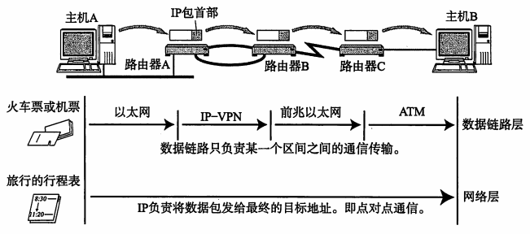
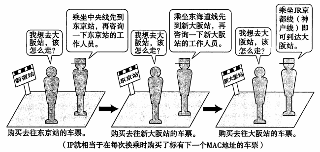
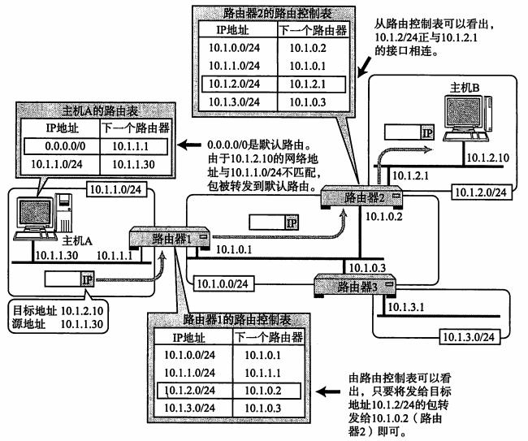

# 读书：图解TCP/IP

* **书中有个很好的图例说明了IP的作用与数据链路的作用**

   

  > 仔细分析一下机票和火车票，不难发现，每张票只能够在某一限定区间内移动。此处的“区间内”就如同通信网络上的数据链路。而这个区间内的出发地点和目的地点就如同某-一个数据链路的源地址和目标地址等首部信息"。整个全程的行程表的作用就相当于网络层。

  

   

  > 可以将旅行者看做IP数据包，将车站和工作人员看做路由器。当某个IP包到达路由器时，路由器首先查找其目标地址，从而再决定下一步应该将这个包发往哪个路由器，然后将包发送过去。当这个IP包到达那个路由器以后，会再次经历查找下一目标地址的过程，并由该路由器转发给下一个被找到的路由器。这个过程可能会反复多次，直到找到最终的目标地址将数据包发送给这个节点。.

  

   
