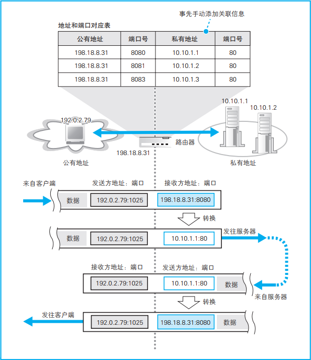

# 读书：网络是怎样连接的

* **地址转换（NAT）的原理**

   

  **NAT的作用：**

  1. 解决`IPv4`地址不够用的问题，实现局域网内`N`个内网地址通过一个公网地址上网。
  
  2. 实现网络安全隔离。
  
     > “换个角度来看， 这意味着对于没有在访问互联网的内网设备， 是无法从互联网向其发送网络包的。 而且即便是正在访问的设备， 也只能向和互联网通信中使用的那个端口发送网络包， 无法向其他端口发送包。 也就是说， 除非公司主动允许， 否则是无法从互联网向公司内网发送网络包的。这种机制具有防止非法入侵的效果。”  
     >
     > ---  即`NAT`可以实现单边访问，内部网络可以访问互联网，但互联网不能访问内部网络。
  
  公司代理的一款裸金属产品就是通过NAT实现上网的，因为每台裸金属服务器都有一个公网IP，显然它这样做不是为了节省IP的目的，而是为了做网络安全隔离。
  
  