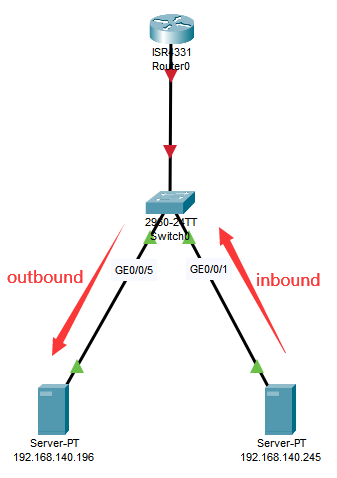

# 华为交换机怎样限制某一IP只允许特定的IP访问

### 需求

由于最近一起疑似通过`IPMI`入侵服务器的安全事件，我开始对我管理的裸金属服务器IPMI安全有所担忧，决定对这些IPMI进行安全限制。我本是打算用ipmitool的raw命令进行限制的，但这命令提示错误，网上相关可查阅资料甚少，于是无奈作罢，转而通过华为交换机的ACL进行限制。

### `ACL `简介

> 访问控制列表`ACL`（`Access Control List`）是由一条或多条规则组成的集合。所谓规则，是指描述报文匹配条件的判断语句，这些条件可以是报文的源地址、目的地址、端口号等。
>
> `ACL`本质上是一种报文过滤器，规则是过滤器的滤芯。设备基于这些规则进行报文匹配，可以过滤出特定的报文，并根据应用`ACL`的业务模块的处理策略来允许或阻止该报文通过。
> ————————————————
> 摘自：[使用ACL限制外网用户访问内网中服务器的权限示例](https://support.huawei.com/enterprise/zh/doc/EDOC1000141427/f856d40)

> 按照`ACL`的功能分类，`ACL`可以分为：基本`ACL`，高级`ACL`，二层`ACL`，用户`ACL`，其中应用最为广泛的是基本`ACL`和高级`ACL`
> **`ACL`分类：**
> 分类 编号范围 参数
> 标准（基本）`ACL` 2000~2999 源IP地址等
> 扩展（高级）`ACL` 3000~3999 源IP地址，目的`IP`地址，源端口，目的端口，协议类型等
> ————————————————
> 摘自：[华为-ACL-访问控制列表（基础理论与配置实验详解）](https://blog.csdn.net/BIGmustang/article/details/107662274)

### 操作步骤

1. 首先获取`IPMI`的`MAC`地址

   ```shell
   [root@localhost ~]# ipmitool -H {IP} -I lanplus -U root -P {密码} lan print
   Set in Progress         : Set Complete
   Auth Type Support       : NONE MD2 MD5 PASSWORD
   Auth Type Enable        : Callback : MD2 MD5
                           : User     : MD2 MD5
                           : Operator : MD2 MD5
                           : Admin    : MD2 MD5
                           : OEM      :
   IP Address Source       : Static Address
   IP Address              : 121.xx.xxx.181
   Subnet Mask             : 255.255.255.128
   MAC Address             : 90:xx:1c:xx:12:xx
   SNMP Community String   : public
   ....
   ```


2. 在华为交换机查询`MAC`得到连接端口

   ```shell
   [HW] system-view
   
   # 通过mac找出连接的端口
   [HW] display mac-address 90xx-1cxx-12xx
   -------------------------------------------------------------------------------
   MAC Address    VLAN/VSI/BD                       Learned-From        Type
   -------------------------------------------------------------------------------
   90xx-1cxx-12xx 21/-/-                            GE0/0/15             dynamic
   
   -------------------------------------------------------------------------------
   Total items displayed = 1
   ```
   
3. 在华为交换机创建`ACL`规则限制

   ```shell
   # 创建 acl
   [HW] acl 3000
   # undo acl 3000 是删除规则集
   [HW] rule 5 permit ip destination {可访问IP} 0
   [HW] rule 10 permit ip destination {可访问IP} 0
   [HW] rule 15 permit ip destination {可访问IP} 0
   # undo rule 15 是删除规则
   ...
   [HW] rule 50 deny ip
   [HW] q
   [HW] interface GigabitEthernet0/0/15
   # 对流入的流量应用 3000 过滤规则
   [HW] traffic-filter inbound acl 3000
   # undo traffic-filter inbound acl 3000 是取消应用规则
   ```

   到这里，我们是限制成功的了。但我对这里为什么用`inbound`有所疑问，明明规则是限制了目的IP（`destination`）的，不应该是用`outbound`么？

### inbound 与 outbound 的区别

> **INBOUND：**是向交换机方向的流量
> **OUTBOUND：**是交换往外部的流量

为了弄清`inbound`与`outbound`的区别，我做了一个小实验。如下图所示，有两台机器：`192.168.140.196`接交换机的`GE0/0/5`端口、`192.168.140.245`接交换机的`GE0/0/1`端口。

 

设置好防火墙的规则，最终规则如下：

```shell
<HW>sys
Enter system view, return user view with Ctrl+Z.
[HW-acl-adv-3000]dis this
#
acl number 3000
 rule 5 permit ip destination 121.xx.xxx.xxx 0
 rule 10 permit ip destination 183.xx.xx.xxx 0
 rule 15 permit ip destination 121.xx.xxx.xxx 0
 rule 50 deny ip
#
return

[HW]in giga 0/0/1
[HW-GigabitEthernet0/0/1]dis this
#
interface GigabitEthernet0/0/1
 port link-type access
 port default vlan 21
 traffic-filter inbound acl 3000
#
return
```

由上面的规则可知，`192.168.140.245`只允许`121.xx.xxx.xxx`、`183.xx.xx.xxx`、`121.xx.xxx.xxx` 这几个IP访问。也就是说`192.168.140.196`是访问不了`192.168.140.245`的，我们来看看是不是真的访问不了。

```shell
# 192.168.140.196 服务器
[root@192.168.140.196]# ping 192.168.140.245
PING 121.10.140.245 (121.10.140.245) 56(84) bytes of data.
# 这里一直没有返回

# 192.168.140.245 服务器
[root@192.168.140.245 ~]# tcpdump host 192.168.140.196
tcpdump: verbose output suppressed, use -v or -vv for full protocol decode
listening on eth0, link-type EN10MB (Ethernet), capture size 262144 bytes
11:35:31.967642 IP 192.168.140.196 > 192.168.140.245: ICMP echo request, id 31237, seq 1, length 64
11:35:31.967705 IP 192.168.140.245 > 192.168.140.196: ICMP echo reply, id 31237, seq 1, length 64
```

由上面我们得知，`192.168.140.196`是可以访问到`192.168.140.245`，而且`192.168.140.245`也有返回数据包给`192.168.140.196`，只不过数据包都给`GigabitEthernet0/0/1`的`traffic-filter inbound acl 3000`拦截了。

如果我想用`outbound`来拦截，应该怎样设置呢？

```shell
[HW-acl-adv-3000]dis this
#
acl number 3000
 rule 5 permit ip source 121.xx.xxx.xxx 0
 rule 10 permit ip source 183.xx.xx.xxx 0
 rule 15 permit ip source 121.xx.xxx.xxx 0
 rule 50 deny ip
 rule 50 deny ip
#
return
[HW]in giga 0/0/1
[HW-GigabitEthernet0/0/1]dis this
#
interface GigabitEthernet0/0/1
 port link-type access
 port default vlan 21
 traffic-filter outbound acl 3000
#
return
```

注意看应用`outbound`过滤时，我们添加的规则是源地址（`source`）的。


---

#### 参考文章：

[交换机调用ACL时候的inbound和outbound该怎么用？](https://blog.csdn.net/NeverGUM/article/details/105400087)
