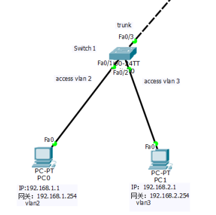

# 第一次接触华为交换机

由于开发裸金属服务器，第一次接触到真实的交换机。因为之前开发`KVM`的云，接触过`OVS`，也使用过`Cisco Packet Tracer`模拟过网络环境，所以第一次接触真实的交换机并不怎么懵逼，上网查了一下华为交换机的入门教程，直接就上手一探究竟了。

### 更换端口的`vlan`值

 

如上面的拓扑图所示，我们的裸金属服务器连接交换机的端口是`access`模式的。这跟云母机是不一样的，云母机的端口是`trunk`模式的。当我们想把祼金属服务器的`IP`换为别的`vlan`段`IP`时，即使上层交换机和路由器已设置好该`vlan`段，直接在服务器上换也是行不通的。

> **Access mode：(untag port)(一般电脑、设备使用)**
>
> ```
> 1、收到一个帧。
> 2、判断是否有 VLAN tag；如果没有则转到第3步，有则转到第4步。
> 3、打上Port的PVID，并进行交换转发。
> 4、直接丢弃。
> ```
> **Trunk mode：(tag port)(Switch交换使用)**
>
> ```
> 1、收到一个帧。
> 2、判断是否有VLAN tag；如果没有则转到第3步，有则转到第4步。
> 3、打上Port的PVID，并进行交换转发。
> (接收没有vlan tag的帧，trunk端口将帧打上vlan tag，vlan ID和本端口的PVID相同，若该PVID在trunk端口的放行vlan中，送入交换机，若PVID不在trunk端口的放行vlan中，丢弃该帧)
> 4、判断该trunk Port是否允许该VLAN的帧进入；如果可以则转发，否则丢弃。
> ```

这时我们需要`telnet`进入交换机将`vlan`改为新的。

```shell
[HW] system-view

# 通过mac找出连接的端口
[HW] display mac-address 782b-cb4b-60d8
-------------------------------------------------------------------------------
MAC Address    VLAN/VSI/BD                       Learned-From        Type
-------------------------------------------------------------------------------
782b-cb4b-60d8 18/-/-                            GE0/0/4             dynamic

-------------------------------------------------------------------------------
Total items displayed = 1

# 进入端口配置
[HW] interface GigabitEthernet0/0/4
[HW] display this # 显示当前接口的信息。可使用shundown关闭端口，使用restart 重启接口

# 上OA查到新的IP的vlan值为21
[HW] port default vlan 21
[HW] quit
# 参考： https://developer.huawei.com/consumer/cn/forum/topic/0204703070841510045?fid=23
```

从上面我们也可以看出，`access`模式是只允许一个`vlan`通过的。如果我们裸金属机器想设置多个网段，那就需要把端口改为`trunk`模式。当改为`trunk`模式后，会存在一个问题，需要在祼金属机器系统上面添加虚拟交换机或者网桥，`linux`添加交换机或者网桥这比较好办，而`windows`系统就有点麻烦了。当然我们祼金属服务器要实现多`vlan`段，没必要搞得这么复杂，只需要通过`golang`程序`telnet`登录交换机，修改为新的`vlan`号就可以实现我们的需求了。

### 限速

裸金属系统需实现对裸金属机器限速，客户购买了多大的带宽，我们会在交换机开通相应的带宽给他。

```shell
[HW] system-view
# 进入端口配置
[HW] interface GigabitEthernet0/0/4
[HW] qos lr inbound cir 8192 # 限入口1M
[HW] qos lr outbound cir 8192 # 限出口1M
# 查看设置是否生效
[HW] display qos lr outbound interface GigabitEthernet0/0/4
[HW] display qos lr inbound interface GigabitEthernet0/0/4
# 参考：https://www.csdn.net/tags/MtTaMgysMDcwNDAxLWJsb2cO0O0O.html
```


由于我们现时的裸金属系统，只有上面的两点需要用到交换机设置，所以只研究了这两方面，以后再有什么新的东西再补充。
