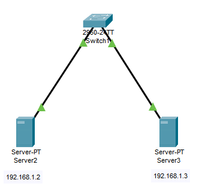
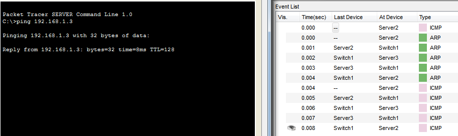
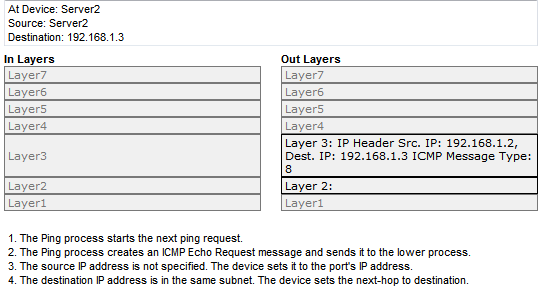
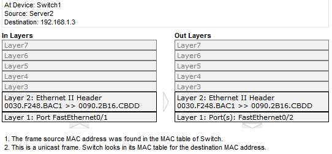

# 网络实险：简单的局域网连接测试

##### 目的

1. 通过实险了解清楚：只二层网络中连接的机器为什么不需要设置网关
2. 通过实险了解清楚二层网络，数据从源机器转发到目的机器的整个流程

#### 拓扑图

如图所示，这是个很简单的网络结构。在 server2 和 server3 两台服务器上，我都没有设置网关。switch1 没有做任务的设置，只是简单将它和两台服务器用网络连接起来。

##### 实验

当我们在 Server2 ping Server3时，数据包的流转如上面的右图所示。

> **详细过程文字描述：**
>
> 1. 在 Server2 ping Server3，通过 IP 协议得知 192.168.1.3 是在同一个子网的，所以将下一跳地址设置为 192.168.1.3
>    
>    由于下一跳IP地址不在 ARP 表中，发送 ARP 包获取 192.168.1.3 的 mac 地址
> 2. ARP包将广播到局域网所有设置，获取到 192.168.1.3 的 mac 地址
> 3. 获取到 mac 地址后，接下来就是通过 二层网络 的以太网协议将包发到目的地址
>    

##### 总结

最后我们回到我们前面的实验目的，为什么我们的服务器不用设置到网关呢？因为在这个例子，我们没有用到三层的设备（如三层交换机或路由器），所以根本不用设置网关作为下一跳的地址。另外一个，我们需要注意的是，我们容易进入一个误区，以为只有三层交换机或者路由器才会用到 IP 协议，其实由这个例子，我们也可以看到在服务器系统也是实现了 IP 协议的，所以我们才会知道源IP和目的IP是同一个子网的。
