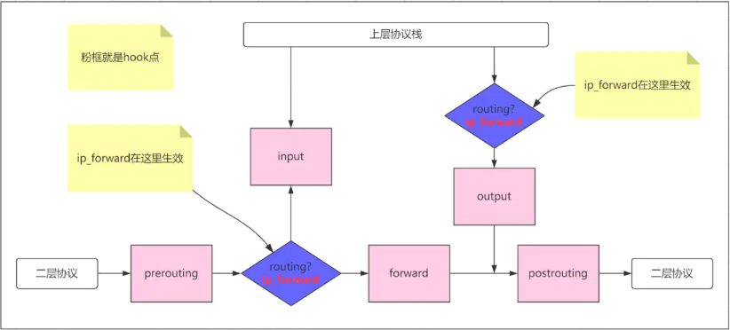
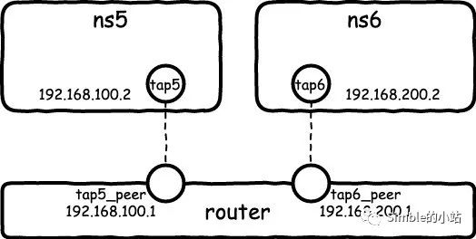

# 解决实现NAT过程中遇到的能访问IP不能访问域名的问题

在《[OVS实现NAT地址转换](ovs/OVS实现NAT地址转换.md)》一文中遇到了设置NAT后，虚拟机内部能`ping`通`IP`不能`ping`通域名的情况。在这篇文章中，我将使用了`network namespace`来重现这个问题，并一步步解决这个问题。


## 重现问题

在测试机器我有一个`br2`的`ovs`网桥，网桥的IP地址为`192.168.141.1`，`ovs`的结构如下：

```shell
ovs-vsctl show;
9cb2735c-a835-4551-ad73-2bf5d96e38bb
    Bridge "br2"
        Port "br2"
            Interface "br2"
                type: internal
    ovs_version: "2.0.0"
```

使用`network namespace`创建一个虚拟网络空间连接到`br2`网桥上面。

```shell
ip netns add ns1;
ip link add ns1-veth0 type veth peer name ns1-veth1;
ip link set ns1-veth1 netns ns1;
ip netns exec ns1 ip addr add 192.168.141.101/24 dev ns1-veth1;
ip netns exec ns1 ip link set dev ns1-veth1 up;
ip netns exec ns1 ip route add default via 192.168.141.1;
ovs-vsctl add-port br2 ns1-veth0;
ip link set dev ns1-veth0 up;
```

现在`ovs`的结构变成了这样：

```shell
ovs-vsctl show;
9cb2735c-a835-4551-ad73-2bf5d96e38bb
    Bridge "br2"
        Port "ns1-veth0"
            Interface "ns1-veth0"
        Port "br2"
            Interface "br2"
                type: internal
    ovs_version: "2.0.0"
```

接下来就要开启转发和地址伪装了。

> 所谓转发即当主机拥有多于一块的网卡时，其中一块收到数据包，根据数据包的目的ip地址将包发往本机另一网卡，该网卡根据路由表继续发送数据包。

首先我们开启`Linux`系统的转发功能，默认情况下，`Linux`的三层包转发功能是关闭的，我们要实现转发，则需要打开这个转发功能

```shell
sysctl net.ipv4.ip_forward=1
# 或者使用下在的命令临时打开转发功能
echo 1 > /proc/sys/net/ipv4/ip_forward
```

接下来开启地址伪装功能

```shell
iptables -t nat -A POSTROUTING -s 192.168.141.0/24 -j MASQUERADE;
```

这时通过`network namespace`访问外网IP和域名

```shell
ip netns exec ns3 ping 114.114.114.114
PING 114.114.114.114 (114.114.114.114) 56(84) bytes of data.
64 bytes from 114.114.114.114: icmp_seq=1 ttl=91 time=30.5 ms
64 bytes from 114.114.114.114: icmp_seq=2 ttl=81 time=29.9 ms

ip netns exec ns3 ping www.baidu.com
ping: www.baidu.com: Temporary failure in name resolution
```

由上面可以看出能`ping`通`IP`不能`ping`通域名，重现了《[OVS实现NAT地址转换](ovs/OVS实现NAT地址转换.md)》一文所说的问题。


## Firewall 的 add-masquerade 底层原理

> firewall-cmd建立在iptables之上，它使用iptables作为其底层技术，并提供了一个更高级别的接口来访问和配置iptables。使用firewall-cmd可以更轻松地配置防火墙规则，而无需深入理解iptables的底层工作原理。

由《[OVS实现NAT地址转换](ovs/OVS实现NAT地址转换.md)》一文，我们知道执行了`firewall-cmd --zone=public --permanent --add-masquerade`命令后，虚拟机里面是可以`ping`通`IP`和域名的。`firewall-cmd`命令最终会生成`iptales`的规则，如果找到`add-masquerade`命令最终生成的规则，那说不定就有办法解决这个问题了。

`add-masquerade`在`nat`表生成的规则：

```shell
iptables -t nat -L --line-numbers | grep -C 5 MASQUERADE
...

Chain POST_public_allow (1 references)
num  target     prot opt source               destination
# firewall-cmd --zone=public --permanent --add-masquerade 命令添加的规则
1    MASQUERADE  all  --  anywhere             anywhere
# iptables -t nat -A POSTROUTING -s 192.168.141.0/24 -j MASQUERADE 命令添加的规则
2    MASQUERADE  all  --  192.168.141.0/24     anywhere

...
```

`POST_public_allow`链的第`1`条规则是使用`firewall-cmd --zone=public --permanent --add-masquerade`生成的，而第`2`条规则是我前面重现问题时创建。从`nat`表的规则，看不出什么问题。

`add-masquerade`除了会在`nat`表生成规则，应该也会在别的表生成其它规则的，先找到这些规则后再作判断。

`iptables-save`命令可以将`iptables`的所有配置或者规则输出，我先输出没有执行`add-masquerade`的规则，再输出执行了`add-masquerade`的规则，最后进行比较。

```shell
# 执行了 firewall-cmd --zone=public --permanent --add-masquerade 命令的
iptables-save
...
-A FORWARD -m conntrack --ctstate RELATED,ESTABLISHED -j ACCEPT
...
-A FWDO_public_allow -m conntrack --ctstate NEW,UNTRACKED -j ACCEPT
...
```

发现执行了`add-masquerade`比没有执行`add-masquerade`的多了一条这样的规则：`-A FWDO_public_allow -m conntrack --ctstate NEW,UNTRACKED -j ACCEPT`，此规则允许从所有网段发出的新和未跟踪的连接通过`FWDO_public_allow`链。证明了执行`add-masquerade`后，除会在`nat`表生成规则，还会在`FORWARD`链生成一条这样的转发规则。

删除`add-masquerade`，手动添加`-A FWDO_public_allow -m conntrack --ctstate NEW,UNTRACKED -j ACCEPT`，再测试，终于可以`ping`通域名了。

```shell
firewall-cmd --zone=public --permanent --remove-masquerade; firewall-cmd --relaod;
iptables -A FWDO_public_allow -s 192.168.10.0/24 -m conntrack --ctstate NEW,UNTRACKED -j ACCEPT
ip netns exec ns3 ping www.baidu.com
PING www.a.shifen.com (14.119.104.189) 56(84) bytes of data.
64 bytes from 14.119.104.189 (14.119.104.189): icmp_seq=1 ttl=53 time=8.12 ms
64 bytes from 14.119.104.189 (14.119.104.189): icmp_seq=2 ttl=53 time=8.12 ms
...
```


## iptables 的 forward 链

前面我们使用`/proc/sys/net/ipv4/ip_forward`开启转发，但这个参数只是一个启动开关，用于控制`Linux`内核是否启用`IP`数据包转发功能，开启了这个参数，系统并不会实现转发，如果要实现转发功能，还需要配合`iptales forward`、`iptales nat`和`ip route`来实现。下面是张经典的``netfilter``的[框架图](https://www.jianshu.com/p/aa838288b33f)：

 

从这张图我们也可以看出，`iptables`的`forward `链的规则只有在开启了`IP`转发功能后才会生效。

虽然`iptables`的`forward `字面意思是转发，但`forward `链并不会进行转发的操作，它会对需要转发的数据进行过滤（`filter`）。由于字面意思，我们很容易误以为在这个链中会进行转发操作，这点是需要注意的。

当开启转发后，配合`ip route`就可以实现路由器的功能，相当于服务器变身为路由器为自身的网卡、虚拟网卡提供转发服务。

 

可以使用下面的命令观察通过的数据包的情况，我们对比开启和关闭转发数据包的`FORWARD`过滤情况，可以得出，NAT的数据包会通过`FORWARD`链。

```shell
iptables -vnL FORWARD
Chain FORWARD (policy ACCEPT 0 packets, 0 bytes)
 pkts bytes target     prot opt in     out     source               destination
  933 83627 ACCEPT     all  --  *      *       0.0.0.0/0            0.0.0.0/0            ctstate RELATED,ESTABLISHED
    0     0 ACCEPT     all  --  lo     *       0.0.0.0/0            0.0.0.0/0
  137  9075 FORWARD_direct  all  --  *      *       0.0.0.0/0            0.0.0.0/0
  137  9075 FORWARD_IN_ZONES_SOURCE  all  --  *      *       0.0.0.0/0            0.0.0.0/0
  137  9075 FORWARD_IN_ZONES  all  --  *      *       0.0.0.0/0            0.0.0.0/0
  119  7563 FORWARD_OUT_ZONES_SOURCE  all  --  *      *       0.0.0.0/0            0.0.0.0/0
  119  7563 FORWARD_OUT_ZONES  all  --  *      *       0.0.0.0/0            0.0.0.0/0
    0     0 DROP       all  --  *      *       0.0.0.0/0            0.0.0.0/0            ctstate INVALID
   71  4539 REJECT     all  --  *      *       0.0.0.0/0            0.0.0.0/0            reject-with icmp-host-prohibited
```

再回到一开始的问题，为什么未开启转发前，可以`ping`通`ip`呢？我把`iptables`的规则都输出，再仔细观察，终于发现下面这条规则。

```shell
iptables-save | grep 'FORWARD\|FWD'
...
-A FWDI_public -p icmp -j ACCEPT
...
```

这条规则会对`icmp`协议的包放行，所以自然可以`ping`通`ip`。


---

执行 firewall-cmd --zone=public --permanent --add-masquerade 后，系统会自动开启包的转发功能，无需我们显示开启

---


### 参考：

[内核参数ip_forward刨根问底](https://www.jianshu.com/p/aa838288b33f)

[Linux虚拟网络基础实验](https://www.modb.pro/db/146899)
