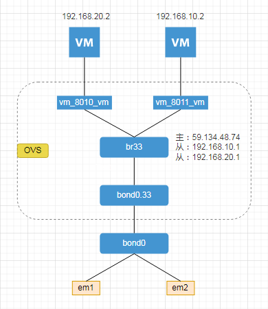

# OVS实现NAT地址转换

我在学习`ovs`时，看到的文章都是说`ovs`是二层交换机。但最近比较火的`ChatGPT`告诉我“`OVS`是一个功能强大的三层交换器，支持多种协议”，我开始有点自我怀疑了。三层交换机最重要一点是有动态路由功能，ovs的流规则可以控制，硬要说这是路由功能，也可以说这是静态路由。但`ovs`并没有动态路由功能，所以`ovs`还是二层交换机，只不过它比二层交换机要强大的，可以通过`openflow`对转发数据进行控制。

回到题目，`ovs`属于二层交换机，而`NAT`是属于三层使用的技术，是不是使用`ovs`实现不了`NAT`地址转换呢？看到文章《[Open vSwitch---流表控制主机数据转发实验（三）---实现NAT地址转换（2）](https://blog.csdn.net/weixin_40042248/article/details/113179363)》通过`openflow`实现了NAT地址转换，于是我也尝试按文章的方法，看能不能实现NAT地址转换。

那篇文章的网络环境是比较简单的，而我这里的环境相对就比较复杂了，具体网络拓扑图如下所示：

 

我在一台物理机`59.134.48.74`上，开了两台虚拟小鸡`192.168.10.2`、`192.168.20.2`，并在br33上配置了多个IP，实现两台不同网段的小鸡互通（可以理解为`vlan`的主从`IP`）。另外`59.134.48.74`的网关为`59.134.48.1`，网关`mac`为`34:01:a3:54:00:54`。

`ovs`上的`br33`端口信息如下所示：

```shell
[root@localhost ~]# ovs-ofctl show br33
 ...
 1(bond0.33): addr:ec:f4:bb:bf:00:60
     config:     0
     state:      0
     current:    1GB-FD
     speed:      1000 Mbps now, 0 Mbps max
 2(vm_8010_vm): addr:fe:05:3b:7d:0a:d5
     config:     0
     state:      0
     current:    10MB-FD COPPER
     speed:      10 Mbps now, 0 Mbps max
 3(vm_8011_vm): addr:fe:81:c5:82:31:0a
     config:     0
     state:      0
     current:    10MB-FD COPPER
     speed:      10 Mbps now, 0 Mbps max
 LOCAL(br33): addr:ec:f4:bb:bf:00:60
     config:     0
     state:      0
     speed:      0 Mbps now, 0 Mbps max
 ...
```


### 全数据NAT

添加流规则，将流入`vm_8010_vm`端口源IP为`192.168.20.2`的数据修改为`59.134.48.74`，并从`bond0.33`流出。

```shell
ovs-ofctl add-flow br33 "ip, in_port=2, table=0, priority=99, nw_src=192.168.20.2, actions=mod_nw_src:59.134.48.74 output:1";
```

```shell
# 在 192.168.20.2
[root@192.168.20.2 ~]# ping 219.129.16.236

# 在 59.134.48.74 进行抓包
[root@59.134.48.74 ~]# tcpdump -ni bond0.33 -e host 219.129.16.236
...
16:09:53.016347 0a:05:3b:7d:0a:d5 > ec:f4:bb:bf:00:60, ethertype IPv4 (0x0800), length 98: 59.134.48.74 > 219.129.16.236: ICMP echo request, id 19304, seq 27, length 64
16:09:54.040367 0a:05:3b:7d:0a:d5 > ec:f4:bb:bf:00:60, ethertype IPv4 (0x0800), length 98: 59.134.48.74 > 219.129.16.236: ICMP echo request, id 19304, seq 28, length 64

# 在 219.129.16.236 进行抓包
[root@219.129.16.236 ~]# tcpdump -n -e host 59.134.48.74
# 没有抓包到数据，证明数据没有转发成功
```

为什么在 219.129.16.236 没有抓包到数据呢？这是因为在192.168.20.2机器我ping的是外网，需要使用网关才可以将数据正常转发出去，而在这台机器中的网关是`192.168.20.1`，还是属于内网网关，自然不能所数据转发到外网。需要把流规则的目标mac修改为网关的`mac`地址`34:01:a3:54:00:54`才行。

```shell
ovs-ofctl add-flow br33 "ip, in_port=2, table=0, priority=99, nw_src=192.168.20.2, actions=mod_nw_src:59.134.48.74,mod_dl_dst:34:01:a3:54:00:54 output:1";
```

添加上面的规则，终于可以在`219.129.16.236`抓包到数据。

```shell
[root@219.129.16.236 ~]# tcpdump -n -e host 59.134.48.74
16:47:45.713730 34:00:a3:54:45:5d > 02:42:d0:a8:84:23, ethertype IPv4 (0x0800), length 98: 59.34.148.74 > 219.129.216.36: ICMP echo request, id 19308, seq 1790, length 64
16:47:45.713770 02:42:d0:a8:84:23 > 34:00:a3:54:45:5d, ethertype IPv4 (0x0800), length 98: 219.129.216.36 > 59.34.148.74: ICMP echo reply, id 19308, seq 1790, length 64
```

但在虚拟小鸡上，还是没接收到`ping`的返回，那是因为我只添加了流出的规则，没有添加流入的规则。

```shell
# 注意这里我把目标地址的mac修改为虚拟小鸡的mac地址
ovs-ofctl add-flow br33 "ip, in_port=1, table=0, priority=99, nw_dst=59.134.48.74, actions=mod_nw_dst:192.168.20.2,mod_dl_dst:0a:05:3b:7d:0a:d5 output:2";
```

添加完流入的规则，发现悲剧了，母鸡登不上了，`ssh`再连登上的是虚拟小鸡。因为流入流出的数据包全都转发到虚拟小鸡上了，母机自然就连接不上了。虽然用这种方法实现了`NAT`地址转换，但这种极限一换一的方式，很明显这不是我想要实现的方式。


### 特定端口NAT

```shell
# bond0.33(流入)
ovs-ofctl add-flow br33 "ip, in_port=bond0.33, table=0, priority=99, tcp, tcp_dst=20022, actions=mod_nw_dst:192.168.20.2,mod_dl_dst:0a:05:3b:7d:0a:d5,mod_tp_dst:22 output:vm_8010_vm";
# vm_8010_vm(流出)
ovs-ofctl add-flow br33 "ip, in_port=vm_8010_vm, table=0, priority=99, nw_src=192.168.20.2, tcp, tcp_src=22, actions=mod_nw_src:59.134.48.74,mod_dl_dst:34:00:a3:54:00:54,mod_tp_src:20022 output:bond0.33";
```

添加好上面两条流规则，我们就可以在外网使用`ssh -p 20022 59.134.48.74`连接上虚拟小鸡了。我只针对虚拟小鸡的22端口做了NAT地址转换，没有做其它的，在虚拟小鸡内是上不了网的。


### OVS + firewall/iptables 实现NAT

从上面可以看出单纯通过`ovs`的流规则控制是实现不了`NAT`地址转换功能的，需要配合`firewall`或`iptables`的转发功能实现。如上面的“特定端口`NAT`”的例子，只需要再执行下面的命令，便可实现虚拟小鸡的内部上网。

```shell
firewall-cmd --zone=public --permanent --add-masquerade; firewall-cmd --reload
```

删除`firewall`的转发：

```shell
firewall-cmd --zone=public --permanent --remove-masquerade; firewall-cmd --reload
```

上面的命令会转发所有私有地址，如果想只转发特定的私有地址可使用如下方法：

**使用`iptables`实现`NAT`转换**

```shell
# 将源地址为 192.168.20.2 的数据包转换为具有单一公共地址的数据包
iptables -t nat -A POSTROUTING -s 192.168.20.2 -j MASQUERADE
# iptables –t nat –A POSTROUTING –s 192.168.20.2 –o br33 –j SNAT --to-source 59.134.48.74
# 查看当前正在运行的 NAT 规则
iptables -t nat -L --line-numbers
# 删除特定的 NAT 规则
iptables -t nat -D POSTROUTING <rule number>
# 注意，<rule number>表示要删除的规则在列表中的位置。因此，你需要先使用 iptables -t nat -L --line-numbers 命令查看当前规则的列表，以确定要删除的规则的编号
```

**使用`firewall`实现`NAT`转换**

```shell
# 使用以下命令在 firewall-cmd 中实现 iptables -t nat -A POSTROUTING -s 192.168.20.2 -j MASQUERADE 功能
firewall-cmd --direct --permanent --add-rule ipv4 nat POSTROUTING 0 -s 192.168.20.2 -j MASQUERADE
# 要查看当前会话中的规则，您可以使用以下命令：
firewall-cmd --direct --get-all-rules
```


-----------

当设置特定IP的NAT转换时，dns被阻断的问题

当设置全 MASQUERADE ，可以ping通域名，但当设置特定的IP或IP段时，还是会阻断的问题。所以猜测可能是某些内部IP也需要设置转发的问题。

```shell
[root@localhost ~]# firewall-cmd --zone=public --permanent --add-rich-rule='rule family="ipv4" masquerade'; firewall-cmd --reload
[root@localhost ~]# iptables -t nat -L --line-numbers|grep MASQUERADE
1    MASQUERADE  all  --  anywhere         anywhere
# 这时候在 192.168.20.2 机器内 ping 域名是通的
[root@localhost ~]# firewall-cmd --zone=public --permanent --remove-rich-rule='rule family="ipv4" masquerade'; firewall-cmd --reload

[root@localhost ~]# firewall-cmd --zone=public --permanent --add-rich-rule='rule family="ipv4" source address="192.168.20.0/24" masquerade'; firewall-cmd --reload
[root@localhost ~]# iptables -t nat -L --line-numbers|grep MASQUERADE
1    MASQUERADE  all  --  192.168.20.0/24      anywhere
# 这时候在 192.168.20.2 机器内 ping 域名不通，但IP是通的
```


-------

### 参考：

[Open vSwitch---流表控制主机数据转发实验（三）---实现NAT地址转换（2）](https://blog.csdn.net/weixin_40042248/article/details/113179363)
[Linux iptables用法与NAT](https://www.cnblogs.com/whych/p/9147900.html)
[Iptables masquerade breaks dns lookups](https://unix.stackexchange.com/questions/466105/iptables-masquerade-breaks-dns-lookups)

