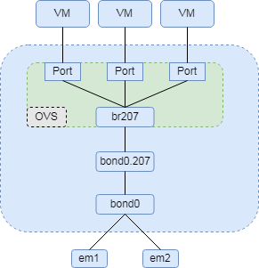

# OVS配置KVM网络实战

### 配置网卡绑定`bond`

> “所谓bond，就是把多个物理网卡绑定成一个逻辑上的网卡，使用同一个IP工作，在增加带宽的同时也可以提高冗余性，一般使用较多的就是来提高冗余，分别和不同交换机相连，提高可靠性，但有时服务器带宽不够了也可以用作增加带宽。” （[**link**](https://www.linuxprobe.com/actual-combat-nic-bond.html)）
>
>  


从下面可以看到，一共四块网卡，`em1`和`em2`是外网网卡，`em4`是内网网卡。我们将`em1`和`em2`做网卡绑定。
```shell
# mode=1：active-backup 主备策略，只有一个slave被激活，只有当active的slave的接口down时，才会激活其它slave接口。(不需要交换机设定)
[root@my network-scripts]# cat ifcfg-bond0
DEVICE=bond0
NAME=bond0
TYPE=Bond
BONDING_MASTER=yes
PEERDNS=yes
ONBOOT=yes
USERCTL=no
BOOTPROTO=none
BONDING_OPTS="miimon=100 mode=1 primary=em1 fail_over_mac=1"

[root@my network-scripts]# cat ifcfg-em1
TYPE=Ethernet
BOOTPROTO=none
NAME=em1
DEVICE=em1
ONBOOT=yes
MASTER=bond0
SLAVE=yes
USERCTL=no

[root@my network-scripts]# cat ifcfg-em2
TYPE=Ethernet
BOOTPROTO=none
NAME=em2
DEVICE=em2
ONBOOT=yes
MASTER=bond0
SLAVE=yes
USERCTL=no

# ip a | grep em3 可以看到网卡状态是down的
[root@my network-scripts]# cat ifcfg-em3
....

# 内网网卡
[root@my network-scripts]# cat ifcfg-em4
DEVICE=em4
TYPE=Ethernet
BOOTPROTO=none
NAME=em4
ONBOOT=yes
NM_CONTROLLED=no

# 验证bonding状态，可以看到当前活动的是em1
[root@my network-scripts]# cat /proc/net/bonding/bond0
Ethernet Channel Bonding Driver: v3.7.1 (April 27, 2011)

Bonding Mode: fault-tolerance (active-backup) (fail_over_mac active)
Primary Slave: em1 (primary_reselect always)
Currently Active Slave: em1
MII Status: up
MII Polling Interval (ms): 100
Up Delay (ms): 0
Down Delay (ms): 0

Slave Interface: em1
....

Slave Interface: em2
....
```

接下来配置网卡绑定的`vlan`，下面这个配置表示`vlan id`是`207`，`VLAN=yes`表示`bond`启用`vlan`，并且配置`OVS`

```shell
[root@my network-scripts]# cat ifcfg-bond0.207
DEVICE=bond0.207
BOOTPROTO=none
ONBOOT=yes
VLAN=yes
NM_CONTROLLED=no
DEVICETYPE=ovs
OVS_BRIDGE=br207
TYPE=OVSPort
```


### 配置本机IP

> “在ovs操作中常常有这么一个现象，将本机的网卡加入到网桥之中后就发现机器的ip地址失效了，不能ssh，不能ping通。这是因为当网卡加入网桥之后，网卡就是交换机上的一个端口，交换机作为二层设备，其端口是不可能有IP地址的，所以本机的IP地址失效。
>
> 那么这样的情况如何处理？处理方法还是有的，关键点就在网桥的一个端口。网桥创建成功后会默认带一个与网桥同名的port，并且这个port的类型是比较特殊的Internal。
>
> Internal 类型可以看做每个OVS交换机有个可以用来处理数据报的本地端口，可以为这个网络设备配置 IP 地址。”（[**link**](https://www.cnblogs.com/goldsunshine/p/11946098.html)）

```shell
[root@my network-scripts]# cat ifcfg-br207
DEVICE=br207
DEVICETYPE=ovs
TYPE=OVSBridge
BOOTPROTO=none
ONBOOT=yes
DELAY=0
NM_CONTROLLED=no
IPADDR=42.xx.66.xxx
NETMASK=255.255.255.128
GATEWAY=42.xx.66.1
DNS1=114.114.114.114
DNS2=8.8.8.8
ZONE=public
```

整个结构图如下所示：

 


### KVM的配置文件绑定OVS的Bridge

在`xml`配置好`OVS`，再通过`xml`创建机器

```xml
    <interface type='bridge'>
      <mac address='1A:6D:E7:27:51:18'/>
      <virtualport type='openvswitch'/>
      <source bridge='br207'/>
      <target dev='vm_5922_vm'/>
      <bandwidth>
        <inbound average='512' peak='512' burst='512'/>
        <outbound average='512' peak='512' burst='512'/>
      </bandwidth>
      <model type='virtio'/>
    </interface>
```

----

**2023/1/19 更新：**

从上面得知在`OVS`中并没有设定`Vlan`，我们的`Vlan`是通过`bond0.27`来打上`tag`的。

---

### 参考：
* [实战网卡bond](https://www.linuxprobe.com/actual-combat-nic-bond.html)
* [网卡bonding模式 - bond0、1、4配置](https://www.cnblogs.com/kaishirenshi/p/10245228.html)
* [CentOS7 ovs(Open vSwitch)のネットワーク設定方法](https://metonymical.hatenablog.com/entry/2018/12/25/210811)
